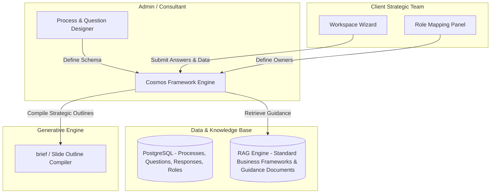

# Project Structure & Documentation Foundation Implementation Plan

> **For agentic workers:** REQUIRED SUB-SKILL: Use superpowers:subagent-driven-development (recommended) or superpowers:executing-plans to implement this plan task-by-task. Steps use checkbox (`- [ ]`) syntax for tracking.

**Goal:** Establish the long-term project structure for Cosmos Strategic Capability Platform: a consolidated `CLAUDE.md`, a `documentation/` knowledge base migrated from `plan/`, a `CHANGELOG.md`, and a real automated test bed — before any further feature work happens.

**Architecture:** Pure documentation/scaffolding change, no application behavior changes. `plan/`'s content is migrated into a categorized `documentation/` tree (product, architecture, development, testing, guides, reference) and then `plan/` is deleted (git history preserves it). `CLAUDE.md` becomes the single consolidated entry point, condensing and linking into `documentation/`. A `pytest` + FastAPI `TestClient` test bed is added against the *current* (pre-migration) API, since `backend/rag_engine.py` already degrades gracefully offline.

**Tech Stack:** Markdown (all new/migrated docs), `pytest` + `httpx` (test bed), existing FastAPI app under test (no changes to its code).

**Spec:** `docs/superpowers/specs/2026-08-24-project-structure-design.md`

## Global Constraints

- Every new or migrated doc's "Last Updated" field is `2026-08-24`.
- `CHANGELOG.md` starts at version `0.1.0`, follows [Keep a Changelog](https://keepachangelog.com/en/1.0.0/) format and [Semantic Versioning](https://semver.org/spec/v2.0.0.html).
- All internal markdown links are relative to the linking file's own location.
- `plan/` is only deleted (Task 8) after every destination file it maps to already exists (Tasks 1-7) — never delete source before destination is verified.
- No changes to `backend/`, `frontend/`, `data/`, or `archives/` application code or data files, except adding `pytest`/`httpx` to `backend/requirements.txt` for the test bed (explicitly in scope per spec).
- Verbatim migrations (BRD, functional spec, technical spec) are done with `cp`, never retyped, to avoid transcription drift.

---

### Task 1: Scaffold `documentation/` tree and migrate verbatim product docs

**Files:**
- Create: `documentation/product/brd.md` (copy of `plan/BRD.md`)
- Create: `documentation/product/functional-spec.md` (copy of `plan/functional_spec.md`)
- Create: `documentation/product/concept-synthesis.md` (copy of `plan/cosmos-platform-concept-synthesis.md`)

**Interfaces:**
- Produces: three files under `documentation/product/`, referenced by links from `documentation/README.md` (Task 7) and `CLAUDE.md` (Task 9).
- Consumes: nothing (source files already exist in `plan/`, untouched until Task 8).

- [ ] **Step 1: Create the directory tree**

```bash
cd "d:/GitHub/Cosmos Strategy Platform"
mkdir -p documentation/product documentation/architecture documentation/development documentation/testing documentation/guides documentation/reference
```

- [ ] **Step 2: Copy the three verbatim files**

```bash
cp "plan/BRD.md" "documentation/product/brd.md"
cp "plan/functional_spec.md" "documentation/product/functional-spec.md"
cp "plan/cosmos-platform-concept-synthesis.md" "documentation/product/concept-synthesis.md"
```

- [ ] **Step 3: Verify**

```bash
diff "plan/BRD.md" "documentation/product/brd.md"
diff "plan/functional_spec.md" "documentation/product/functional-spec.md"
diff "plan/cosmos-platform-concept-synthesis.md" "documentation/product/concept-synthesis.md"
```

Expected: all three `diff` commands print nothing (files identical).

- [ ] **Step 4: Commit**

```bash
git add documentation/product/brd.md documentation/product/functional-spec.md documentation/product/concept-synthesis.md
git commit -m "docs: migrate BRD, functional spec, and concept synthesis into documentation/product/"
```

---

### Task 2: Write `documentation/product/roadmap.md`

**Files:**
- Create: `documentation/product/roadmap.md`

**Interfaces:**
- Produces: `documentation/product/roadmap.md`, linked from `documentation/README.md` (Task 7), `CLAUDE.md` Parts 1/5 (Task 9), `documentation/architecture/overview.md` (Task 3), `documentation/testing/test-strategy.md` (Task 5).
- Consumes: content from `plan/task.md` and `plan/implementation_plan.md` (read, not copied — this file synthesizes them).

- [ ] **Step 1: Write the file**

```markdown
# Product Roadmap — Cosmos Strategic Capability Platform

**Last Updated:** 2026-08-24

This is the living status document for the project: what's been decided, what's built, and what's next. It replaces the one-time `plan/task.md` checklist and the forward-looking sections of `plan/implementation_plan.md`.

## Current Phase: Insights POC — Specs Complete, Implementation Not Started

The project has fully specified the pivot from a static "Q&A critic" (hardcoded Blazar/Basil case studies, single rating/critique/recommendations output) to an **interactive process authoring and execution engine** (the "Framework Factory") backed by a configurable SQLite process/stage/question schema and Level 1/2/3 comparative benchmark generation. See `documentation/architecture/overview.md` for the target architecture and `documentation/development/technical-spec.md` for the schema and API contract.

**None of the migration below has been implemented yet.** The running code (`backend/main.py`, `backend/database.py`) still reflects the old design: an in-memory `CASES_DATA` dict with the Blazar/Basil cases, and a `responses` table with legacy `rating`/`critique`/`recommendations` fields.

## Migration Checklist

### 1. Database Layer Overhaul
- [ ] Update DDL in `backend/database.py` to migrate the `responses` table:
  - Remove legacy `rating`, `critique`, and `recommendations` fields.
  - Add `self_evaluation_notes` (TEXT) and `self_evaluation_status` (TEXT) fields.
- [ ] Adapt DB seeding code to include process, stages, and questions matching the Brand Compass configuration.
- [ ] Run migration command and recreate `cosmos_platform.db`.

### 2. Backend API Integration
- [ ] Connect `backend/main.py` to the SQLite database:
  - Query cases/projects dynamically from SQLite rather than the hardcoded in-memory `CASES_DATA`.
  - Add DB routes to get stages and questions by process ID.
- [ ] Overhaul `POST /api/evaluate` to output comparative benchmarks:
  - Refactor system and user prompts to generate Level 1, 2, and 3 comparative responses.
  - Refactor the response payload shape.
- [ ] Implement `POST /api/response/save` to store submitted text, self-evaluation notes, and self-evaluation status.
- [ ] Add `GET /api/process/{process_id}/brief` to output a compiled markdown/HTML summary brief.

### 3. Frontend GUI Overhaul
- [ ] Update `frontend/app.js` to fetch cases, stages, and questions dynamically from the backend.
- [ ] Build the split-screen comparison UI:
  - User's answer side-by-side with RAG context slides.
  - Level 1/2/3 exemplary comparative answers.
  - Self-Evaluation Notes input and a status selector (Needs Work, Satisfactory, Strong).
- [ ] Add a "Download Brief" button.
- [ ] Refine `frontend/style.css` (dark/light tokens, Outfit/Inter typography, loading skeletons, responsive split columns).

## Planned Verification (once migration lands)

- **Automated**: schema migration validation for process creation; a test for the brief-compilation endpoint that extracts structured execution data into a strategic briefing document.
- **Manual**: full walkthrough — author a custom Insights process, map user roles, submit answers, run guided self-evaluation against benchmark responses, generate a finalized strategic brief.

The current automated test bed (`tests/`) covers the *pre-migration* API contract only — see `documentation/testing/test-strategy.md`. Those tests will need rewriting once this checklist lands.

## Beyond the POC (not yet scoped)

The BRD frames this POC as validation before a full multi-tenant build. Not yet designed:
- Framework Authoring Mode (admin/consultant interface to define new processes, stages, and questions beyond the seeded Brand Compass configuration).
- Role-based hierarchy enforcement and peer visibility panels (owner/reviewer/peer permissions are defined in the functional spec but not yet enforced by any code).
- Multi-tenant data isolation, and the PostgreSQL-backed storage layer sketched in the original Framework Factory proposal (see `documentation/architecture/overview.md`).
```

- [ ] **Step 2: Verify**

```bash
test -f "documentation/product/roadmap.md" && echo "exists"
```

Expected: `exists`.

- [ ] **Step 3: Commit**

```bash
git add documentation/product/roadmap.md
git commit -m "docs: add living product roadmap consolidating task.md and implementation_plan.md"
```

---

### Task 3: Write `documentation/architecture/overview.md`

**Files:**
- Create: `documentation/architecture/overview.md`

**Interfaces:**
- Produces: `documentation/architecture/overview.md`, linked from `documentation/README.md` (Task 7), `CLAUDE.md` Part 2 (Task 9), `documentation/product/roadmap.md` (already written in Task 2, references this file).
- Consumes: content from `plan/architecture.md` and the architecture-relevant sections of `plan/implementation_plan.md` (read, not copied).

- [ ] **Step 1: Write the file**

```markdown
# Architecture Overview — Cosmos Strategic Capability Platform

**Last Updated:** 2026-08-24

This document describes two things: the **current POC architecture** (implemented, three-tier, SQLite-backed) and the **target Framework Factory architecture** (proposed in the original pivot plan, not yet implemented). See `documentation/product/roadmap.md` for what separates the two today.

## 1. Current POC Architecture

### 1.1 High-Level Overview

Three-tier architecture: a Client Interface, an API Application Layer, and a dual-data storage subsystem (relational SQLite and vector JSON).

```
 ┌────────────────────────────────────────────────────────┐
 │                   1. Presentation Layer                │
 │             Vanilla HTML5 / CSS3 / ES6 Javascript      │
 └───────────────────────────┬────────────────────────────┘
                             │
                             │ REST / HTTP (JSON)
                             ▼
 ┌────────────────────────────────────────────────────────┐
 │                 2. Application API Layer               │
 │                   Python FastAPI Engine                │
 └──────┬────────────────────┬────────────────────┬───────┘
        │                    │                    │
        ▼                    ▼                    ▼
 ┌──────────────┐    ┌──────────────┐    ┌────────────────┐
 │  3a. RAG     │    │  3b. LLM     │    │  3c. SQL DB    │
 │ Embedding    │    │ AWS Bedrock  │    │  sqlite3 Core  │
 └──────┬───────┘    └──────────────┘    └────────┬───────┘
        │                                         │
        ▼                                         ▼
 ┌──────────────┐                        ┌────────────────┐
 │ Vector DB    │                        │  Relational DB │
 │ vector_db.json│                       │  cosmos_platform.db
 └──────────────┘                        └────────────────┘
```

### 1.2 Component Breakdown

**Presentation Layer (`frontend/`)** — single-page app using standard browser APIs:
- UI Router: toggles views (Case Select, Process Dashboard, Q&A Editor) on state transitions.
- Workspace Engine: renders stages and questions from API schema payloads.
- Self-Evaluation Module: split-screen comparative workspace next to RAG references.
- Style Engine: CSS variable tokens for dark mode and typography.

**Application API Layer (`backend/main.py`)** — FastAPI microservice:
- Routing Controller: CRUD paths for configurations and evaluation transactions.
- Database Manager (`backend/database.py`): SQLite connection, DDL, and seeding.
- RAG Orchestrator (`backend/rag_engine.py`): search indexing, PDF extraction, vector loading, distance calculation.
- Generative Gateway: talks to AWS Bedrock via `boto3` to invoke Claude models, with a local heuristic fallback when no AWS credentials are configured.

**Storage Layer (`data/`)**:
- `cosmos_platform.db` (SQLite): processes, stages, questions, guidance, and response/self-evaluation records.
- `vector_db.json` (flat file): precomputed 384-dimensional page vectors from the source consulting decks in `archives/`.

### 1.3 Core Data Flow — Workspace Q&A and Guided Self-Evaluation

1. User writes an answer for a question in a case and triggers an evaluation request.
2. The API retrieves the question's `search_query` and embeds it using `SentenceTransformer`.
3. The embedding is compared against the cached vectors in `vector_db.json` using cosine similarity.
4. The top 3 matching slide contexts are fetched.
5. The API sends the question, the user's answer, and the retrieved context slides to AWS Bedrock.
6. The LLM returns a structured JSON containing Level 1 (Superficial), Level 2 (Needs-based), and Level 3 (Insight-driven) benchmark answers, plus targeted diagnostic questions.
7. The frontend displays these comparative benchmarks to the user.
8. The user updates their response, logs self-reflection notes, sets a self-evaluation rating, and saves.
9. The backend writes the response, self-evaluation, and status to SQLite.

*(Note: steps 5-9 describe the **target** behavior once the migration checklist lands — see `documentation/product/roadmap.md`. Today, `/api/evaluate` still returns the older single `rating`/`critique`/`recommendations` shape.)*

## 2. Target Architecture: The Framework Factory (Proposed, Not Yet Built)

The original pivot insight: the slide decks (like the Madura Brand Compass) are *outputs*; the application should be the factory that configures the strategic frameworks that generate those outputs — not a hardcoded case-study critic.



This diagram uses PostgreSQL rather than the current SQLite — a multi-tenant scale consideration for **beyond the POC** (see `documentation/product/roadmap.md`). The POC deliberately stays on SQLite.

### Proposed Data Schema & Entities

- **ManagementProcess**: `id`, `name` (e.g., "Brand Compass V2"), `description`.
- **Stage**: `id`, `process_id`, `name` (e.g., "Prepare"), `sequence_order`.
- **Question**: `id`, `stage_id`, `level` (e.g., "Level 5: Brand Relationship"), `text`, `owner_role` (e.g., "CMO"), `reviewer_role` (e.g., "CEO").
- **GuidanceModule**: `id`, `question_id`, `type` (e.g., "Matrix", "Case Study"), `content_reference`.
- **Response**: `id`, `question_id`, `client_case_id`, `submitted_text`, `submitted_data`, `self_evaluation_notes`, `self_evaluation_status`, `status` (Draft, Locked, Reviewed).

The POC's actual schema (SQLite, scoped to what's needed now) is documented in full in `documentation/development/technical-spec.md` — it is the authoritative near-term schema; the entities above are the longer-term superset.

### Three Proposed Operating Modes

1. **Framework Authoring Mode** (Admin/Consultant): Process Modeler, Question & Guidance Designer, Hierarchy & Role Configurator.
2. **Framework Execution Mode** (Client Team): Dashboard, Execution Workspace, Peer Visibility Panel.
3. **Output Compilation Mode**: compiles structured inputs into a standardized consulting brief or slide outline.

Only a subset of Framework Execution Mode is in scope for the current POC (see `documentation/product/roadmap.md`); Authoring Mode and multi-tenant Peer Visibility are future work.
```

- [ ] **Step 2: Verify**

```bash
test -f "documentation/architecture/overview.md" && echo "exists"
```

Expected: `exists`.

- [ ] **Step 3: Commit**

```bash
git add documentation/architecture/overview.md
git commit -m "docs: add architecture overview merging current POC and target Framework Factory design"
```

---

### Task 4: Migrate `documentation/development/technical-spec.md`

**Files:**
- Create: `documentation/development/technical-spec.md` (copy of `plan/technical_spec.md`)

**Interfaces:**
- Produces: `documentation/development/technical-spec.md`, linked from `documentation/README.md` (Task 7), `CLAUDE.md` Part 4 (Task 9), `documentation/architecture/overview.md` (already written, references this file), `documentation/testing/test-strategy.md` (Task 5).
- Consumes: nothing (verbatim copy).

- [ ] **Step 1: Copy the file**

```bash
cd "d:/GitHub/Cosmos Strategy Platform"
cp "plan/technical_spec.md" "documentation/development/technical-spec.md"
```

- [ ] **Step 2: Verify**

```bash
diff "plan/technical_spec.md" "documentation/development/technical-spec.md"
```

Expected: no output (files identical).

- [ ] **Step 3: Commit**

```bash
git add documentation/development/technical-spec.md
git commit -m "docs: migrate technical spec into documentation/development/"
```

---

### Task 5: Write `documentation/testing/test-strategy.md`

**Files:**
- Create: `documentation/testing/test-strategy.md`

**Interfaces:**
- Produces: `documentation/testing/test-strategy.md`, linked from `documentation/README.md` (Task 7), `CLAUDE.md` Part 6 (Task 9), `tests/README.md` (Task 15).
- Consumes: verification-plan content from `plan/implementation_plan.md` (read, not copied); describes the test bed built in Tasks 12-15.

- [ ] **Step 1: Write the file**

```markdown
# Test Strategy — Cosmos Strategic Capability Platform

**Last Updated:** 2026-08-24

## Philosophy

Test what exists, honestly. The backend is mid-migration (see `documentation/product/roadmap.md`): the current API contract is already scheduled to change. Tests added now document *current* behavior so regressions are caught during the migration, not to lock in a design we already know is temporary.

## Current Test Bed

Location: `tests/` at the repo root, run with `pytest` from the repo root.

- **Framework**: `pytest` + FastAPI's `TestClient` (via `httpx`).
- **Scope**: the current (pre-migration) REST API in `backend/main.py` — `/api/status`, `/api/cases`, `/api/case/{case_id}`, `/api/evaluate`.
- **No network/AWS dependency required to pass**: `backend/rag_engine.py` already degrades gracefully — no AWS credentials means `bedrock_client` stays `None` and evaluation falls back to a local heuristic critique (`fallback_local_critique`); if the archive PDFs were ever missing, vector indexing falls back to a synthetic in-memory dataset. The tests exercise these fallback paths rather than mocking around them.
- **First-run cost**: `RagEngine.__init__` always loads the `all-MiniLM-L6-v2` SentenceTransformer model (downloaded once, ~80MB, cached locally after) and the existing 8MB `data/vector_db.json`. This is the same cost the app already pays on every startup — the test bed doesn't add to it.

## What's Covered

| Test file | Covers |
|---|---|
| `tests/test_api_status.py` | `GET /api/status` shape (`vector_db_size` int, `aws_connected` bool, `region` str). |
| `tests/test_api_cases.py` | `GET /api/cases` returns the seeded Blazar/Basil cases; `GET /api/case/{id}` 200 for a known id and 404 for an unknown one. |
| `tests/test_api_evaluate.py` | `POST /api/evaluate` against the *current* `rating`/`critique`/`recommendations`/`source_slides` response shape. |

## Known Limitation — Will Break On Purpose

`test_api_evaluate.py` and the `/api/case/{id}` assertions in `test_api_cases.py` are pinned to the **pre-migration** contract: the hardcoded `CASES_DATA` dict and the `rating`/`critique`/`recommendations` payload shape. Once the roadmap's "Backend API Integration" checklist lands (DB-backed cases, Level 1/2/3 benchmark payload, `self_evaluation_notes`/`self_evaluation_status`), these two files must be rewritten, not just extended. Treat their failure after that migration as expected, not a bug.

## Planned Coverage (not yet implemented)

From the original implementation plan's verification section — tracked here so it isn't lost, not yet built:
- Schema migration validation for process creation (the Insights POC module's process/stage/question seed).
- A test for the `GET /api/process/{process_id}/brief` endpoint once it exists, verifying it extracts structured execution data into a well-formed strategic briefing document.
- Frontend testing approach is not yet scoped — `frontend/` is vanilla JS with no test runner configured today.

## Manual Verification

Until the migration lands, the meaningful manual check is the one described in `documentation/product/roadmap.md`: author a custom Insights process, map user roles, submit answers, run guided self-evaluation, generate a brief. No automated coverage exists for that flow yet because the underlying features don't exist yet.
```

- [ ] **Step 2: Verify**

```bash
test -f "documentation/testing/test-strategy.md" && echo "exists"
```

Expected: `exists`.

- [ ] **Step 3: Commit**

```bash
git add documentation/testing/test-strategy.md
git commit -m "docs: add test strategy describing current pytest bed and known limitations"
```

---

### Task 6: Write `documentation/guides/quick-start.md` and `documentation/reference/source-materials.md`

**Files:**
- Create: `documentation/guides/quick-start.md`
- Create: `documentation/reference/source-materials.md`

**Interfaces:**
- Produces: both files, linked from `documentation/README.md` (Task 7) and `CLAUDE.md` (Task 9); `quick-start.md` is also linked from the trimmed `README.md` (Task 11).
- Consumes: setup steps currently in the root `README.md` (read, not copied — will be superseded by Task 11); archive file listing from `archives/`.

- [ ] **Step 1: Write `documentation/guides/quick-start.md`**

```markdown
# Quick Start — Cosmos Strategic Capability Platform

**Last Updated:** 2026-08-24

## 1. Backend Setup

From the repo root:

```bash
cd backend
python -m venv venv

# Windows (CMD/PowerShell)
.\venv\Scripts\activate
# macOS/Linux
source venv/bin/activate

pip install -r requirements.txt
```

## 2. Initialize the Database & Vector Index

```bash
python database.py
```

This creates `data/cosmos_platform.db` and seeds the initial process/stage/question configuration. On first run it also parses the PDFs in `archives/` (`ABG.Madura...` and `ABG.Brand...`), computes embeddings, and caches them to `data/vector_db.json`. This step downloads the `all-MiniLM-L6-v2` embedding model the first time it runs — it needs internet access once, then works offline.

## 3. Run the Development Server

```bash
python main.py
```

The API runs at `http://localhost:8000`; the frontend is served automatically at `/`.

## 4. Run the Tests

From the repo root (not `backend/`):

```bash
pytest
```

See `documentation/testing/test-strategy.md` for what's covered and what isn't yet.

## Troubleshooting

- **No AWS credentials configured**: expected during local development. `/api/evaluate` falls back to a local heuristic critique instead of calling Bedrock — see `documentation/architecture/overview.md`.
- **First `python database.py` run is slow**: it's parsing two large PDFs and computing embeddings for every slide. Subsequent runs load the cached `data/vector_db.json` instead and are fast.
```

- [ ] **Step 2: Write `documentation/reference/source-materials.md`**

```markdown
# Source Materials — Cosmos Strategic Capability Platform

**Last Updated:** 2026-08-24

Everything in `archives/` is raw input to the RAG ingestion pipeline (`backend/rag_engine.py`) — the content these decks contain becomes the retrievable "slide context" behind the Guided Self-Evaluation feature (see `documentation/architecture/overview.md`, section 1.3).

| File | What it is | Used for |
|---|---|---|
| `archives/ABG.Madura.Brand Compass.Phase1.V2.pdf` | Phase 1 Aditya Birla Group Madura Brand Compass deck. | Parsed page-by-page into slide records, embedded, and cached in `data/vector_db.json`. |
| `archives/ABG.Brand Compass.Phase2.V1.pdf` | Phase 2 Aditya Birla Group Brand Compass deck. | Same as above. |
| `archives/Relevant slides Phase 1 file.txt` | Short note listing which Phase 1 slides are relevant. | Reference only — not currently parsed by any code. |
| `archives/Strategy Platform Meeting 19Aug.txt` | Transcript/notes from the August 19, 2026 project kickoff meeting. | Historical context for the original concept — see `documentation/product/concept-synthesis.md`, which was derived from this meeting. |

These are large binary/text files; they are the source of truth for the vector database, not something to hand-edit. To regenerate `data/vector_db.json` from scratch, delete it and re-run `python database.py` (see `documentation/guides/quick-start.md`).
```

- [ ] **Step 3: Verify**

```bash
test -f "documentation/guides/quick-start.md" && echo "quick-start exists"
test -f "documentation/reference/source-materials.md" && echo "source-materials exists"
```

Expected: both `exists` lines print.

- [ ] **Step 4: Commit**

```bash
git add documentation/guides/quick-start.md documentation/reference/source-materials.md
git commit -m "docs: add quick-start guide and source materials reference"
```

---

### Task 7: Write `documentation/README.md`

**Files:**
- Create: `documentation/README.md`

**Interfaces:**
- Produces: `documentation/README.md`, linked from the root `CLAUDE.md` (Task 9) and root `README.md` (Task 11).
- Consumes: file paths from every file created in Tasks 1-6 (all must exist before this task runs).

- [ ] **Step 1: Write the file**

```markdown
# Documentation Index — Cosmos Strategic Capability Platform

**Last Updated:** 2026-08-24

Welcome to the Cosmos Strategic Capability Platform documentation. This is the index; for the single-file project overview, see [`CLAUDE.md`](../CLAUDE.md) at the repo root.

## Quick Links

| I want to... | Go to... |
|---|---|
| Understand the business case | [BRD](./product/brd.md) |
| Understand user roles & workflows | [Functional Spec](./product/functional-spec.md) |
| See what's built vs. planned | [Roadmap](./product/roadmap.md) |
| Understand the system architecture | [Architecture Overview](./architecture/overview.md) |
| See the DB schema & API contract | [Technical Spec](./development/technical-spec.md) |
| Get the app running locally | [Quick Start](./guides/quick-start.md) |
| Understand test coverage | [Test Strategy](./testing/test-strategy.md) |
| See what the source PDFs are | [Source Materials](./reference/source-materials.md) |
| Read the original ideation doc | [Concept Synthesis](./product/concept-synthesis.md) |
| See the version history | [CHANGELOG](../CHANGELOG.md) |

## Documentation Structure

```
documentation/
├── README.md                 # this file
├── product/
│   ├── brd.md                 # Business Requirements Document
│   ├── functional-spec.md     # User roles, workflows, UI/UX requirements
│   ├── roadmap.md             # Living status: what's done, what's next
│   └── concept-synthesis.md   # Original ideation doc (historical)
├── architecture/
│   └── overview.md            # Current POC architecture + target Framework Factory architecture
├── development/
│   └── technical-spec.md      # DB schema (DDL), API endpoints, RAG pipeline
├── testing/
│   └── test-strategy.md       # What's tested, how, and known limitations
├── guides/
│   └── quick-start.md         # Setup & run instructions
└── reference/
    └── source-materials.md    # Index of archives/ source PDFs
```

## Status Snapshot

- **Phase**: Insights POC — specs complete, code migration not started.
- **Running code** still reflects the pre-pivot design (hardcoded Blazar/Basil cases, legacy rating/critique/recommendations output).
- **Test bed**: `pytest` suite covering the current pre-migration API contract (see [Test Strategy](./testing/test-strategy.md)).

Full detail: [Roadmap](./product/roadmap.md).
```

- [ ] **Step 2: Verify**

```bash
test -f "documentation/README.md" && echo "exists"
```

Expected: `exists`.

- [ ] **Step 3: Commit**

```bash
git add documentation/README.md
git commit -m "docs: add documentation index with quick links and status snapshot"
```

---

### Task 8: Retire `plan/`

**Files:**
- Delete: `plan/BRD.md`, `plan/functional_spec.md`, `plan/technical_spec.md`, `plan/architecture.md`, `plan/cosmos-platform-concept-synthesis.md`, `plan/implementation_plan.md`, `plan/task.md`

**Interfaces:**
- Consumes: confirmation that every file in `documentation/` from Tasks 1-7 exists (this task must run after all of them).
- Produces: nothing new; removes the superseded `plan/` folder from the working tree (history retained via git).

- [ ] **Step 1: Confirm every destination file exists before deleting anything**

```bash
cd "d:/GitHub/Cosmos Strategy Platform"
for f in documentation/product/brd.md documentation/product/functional-spec.md documentation/product/concept-synthesis.md documentation/product/roadmap.md documentation/architecture/overview.md documentation/development/technical-spec.md documentation/testing/test-strategy.md documentation/guides/quick-start.md documentation/reference/source-materials.md documentation/README.md; do
  test -f "$f" || echo "MISSING: $f"
done
```

Expected: no output (no `MISSING:` lines). If any line prints, stop and go back to the task that was supposed to create that file before proceeding.

- [ ] **Step 2: Remove `plan/`**

```bash
git rm -r plan/
```

- [ ] **Step 3: Verify git history is preserved**

```bash
git log --follow --oneline -- plan/BRD.md
```

Expected: shows the original commit(s) that created/modified `plan/BRD.md` (history follows the rename/delete, since `documentation/product/brd.md` was added as a separate `cp`-based commit in Task 1, git will show `plan/BRD.md`'s own history up to its deletion — this is expected; the two files are related by content, not by a tracked git rename).

- [ ] **Step 4: Commit**

```bash
git commit -m "docs: retire plan/ folder now that its content lives in documentation/"
```

---

### Task 9: Write `CLAUDE.md`

**Files:**
- Create: `CLAUDE.md` (repo root)

**Interfaces:**
- Produces: `CLAUDE.md`, the single consolidated project reference. Linked from root `README.md` (Task 11).
- Consumes: file paths and content summaries from every `documentation/` file created in Tasks 1-7.

- [ ] **Step 1: Write the file**

```markdown
# CLAUDE.md — Cosmos Strategic Capability Platform

This file is the single consolidated reference for working on this codebase — project context, architecture, current status, and development conventions in one place. Claude Code should read this before making changes. For full-depth detail on any topic, follow the links into `documentation/`.

---

## Table of Contents

| Part | Section |
|---|---|
| 1 | [Project Overview](#part-1-project-overview) |
| 2 | [Architecture](#part-2-architecture) |
| 3 | [Tech Stack & Directory Structure](#part-3-tech-stack--directory-structure) |
| 4 | [Data & API](#part-4-data--api) |
| 5 | [Current Status & Roadmap](#part-5-current-status--roadmap) |
| 6 | [Development Workflow](#part-6-development-workflow) |
| 7 | [Documentation Map](#part-7-documentation-map) |

### Quick Links
- [Full Roadmap](documentation/product/roadmap.md) — what's built vs. planned
- [Technical Spec](documentation/development/technical-spec.md) — DB schema & API contract
- [Quick Start](documentation/guides/quick-start.md) — get it running locally
- [Test Strategy](documentation/testing/test-strategy.md) — what's tested and how

---

# Part 1: Project Overview

**Cosmos Strategic Capability Platform** scales a premium, facilitator-led strategy consulting methodology into a self-serve, interactive SaaS product ("DIY Consulting"). Instead of grading users against compliance checklists, it confronts executive teams with **restlessness-arousing questions** — e.g. *"If every customer left, who would be the last to leave and why?"* — and drives **Guided Self-Evaluation**: the user compares their own answer against AI-generated benchmark answers at three depths (Level 1 superficial → Level 3 insight-driven) instead of being graded by an external consultant.

**Core business problems this addresses** (full detail: [BRD](documentation/product/brd.md)):
- Traditional strategic training has high churn and no evidence it changes real-world outcomes.
- Treating senior professionals as "students" creates stature asymmetry and low engagement — the platform treats users as peers.
- Classic stage-gate templates optimize for compliance/form-filling, not deep thinking.

**POC Scope**: the **Insights Module** — SWOT, Opportunity, and Consumer Analysis through the Insight Spiral — validating the hypothesis that an LLM-backed RAG engine can support Guided Self-Evaluation without a live human facilitator.

**User personas** (full detail: [Functional Spec](documentation/product/functional-spec.md)): Admin/Consultant (authors processes), Owner e.g. CMO (submits & self-evaluates answers), Reviewer e.g. CEO (reviews locked answers), Peer e.g. COO (read-only visibility for reputational accountability).

---

# Part 2: Architecture

Three-tier: Presentation (vanilla HTML/CSS/JS) → Application API (FastAPI) → dual storage (SQLite relational + flat-file vector JSON). Full detail, diagrams, and the proposed longer-term "Framework Factory" architecture: [Architecture Overview](documentation/architecture/overview.md).

**Core data flow (target — see Part 5 for what's actually implemented today):**
1. User submits an answer to a strategic question.
2. Backend embeds the question's `search_query` with `SentenceTransformer` and runs cosine similarity search over `data/vector_db.json`.
3. Top 3 matching slide contexts + the question + the user's answer go to AWS Bedrock (Claude).
4. Bedrock returns Level 1/2/3 comparative benchmark answers.
5. User self-evaluates against the benchmarks, logs notes and a status rating, and saves.
6. Backend persists the response and self-evaluation to SQLite.

**Graceful degradation**: no AWS credentials → local heuristic critique fallback. No/unparseable archive PDFs → synthetic in-memory vector dataset. This means the app (and its tests) run fully offline.

---

# Part 3: Tech Stack & Directory Structure

**Backend**: Python 3.10+, FastAPI, SQLite (`sqlite3`), `SentenceTransformer("all-MiniLM-L6-v2")` for local embeddings, `boto3` for AWS Bedrock (Claude 3.5 Sonnet).
**Frontend**: HTML5, vanilla CSS3, ES6+ JavaScript — no framework, no build step.
**Testing**: `pytest` + FastAPI `TestClient` (`httpx`).

```
Cosmos Strategy Platform/
├── CLAUDE.md                # this file
├── CHANGELOG.md              # version history (Keep a Changelog + SemVer)
├── README.md                 # short public-facing intro
├── documentation/            # full knowledge base — see Part 7
├── backend/
│   ├── main.py                # FastAPI app & routes
│   ├── database.py             # SQLite connection, DDL, seed data
│   ├── rag_engine.py           # SentenceTransformer + Bedrock RAG client
│   └── requirements.txt
├── frontend/
│   ├── index.html
│   ├── app.js
│   └── style.css
├── data/
│   ├── cosmos_platform.db      # SQLite (gitignored, generated)
│   └── vector_db.json          # precomputed embeddings (generated, checked in)
├── archives/                  # source PDFs for RAG ingestion
└── tests/                     # pytest suite — see Part 6
```

---

# Part 4: Data & API

**This section describes the CURRENT (pre-migration) schema and API.** The target schema/API is specified in [Technical Spec](documentation/development/technical-spec.md) and tracked in [Roadmap](documentation/product/roadmap.md) — they differ from what's below.

**Current `responses` table** (`backend/database.py`): `id`, `question_id`, `client_case_id`, `submitted_text`, `status`, `rating`, `critique`, `recommendations`, `updated_at`. (Target: replace `rating`/`critique`/`recommendations` with `self_evaluation_notes` and `self_evaluation_status`.)

**Current API** (`backend/main.py`):

| Endpoint | Behavior today |
|---|---|
| `GET /api/status` | Vector DB size, AWS connection status, region. |
| `GET /api/cases` | Returns the two hardcoded cases (Blazar, Basil) from in-memory `CASES_DATA`. |
| `GET /api/case/{case_id}` | Full case detail incl. its 7 questions; 404 if unknown. |
| `POST /api/evaluate` | RAG search + Bedrock call; returns `rating`/`critique`/`recommendations`/`source_slides`. |

Target endpoints not yet implemented: `GET /api/process/{process_id}` (DB-backed stages/questions), `POST /api/response/save`, `GET /api/process/{process_id}/brief`. Full DDL and target endpoint contracts: [Technical Spec](documentation/development/technical-spec.md).

---

# Part 5: Current Status & Roadmap

**As of 2026-08-24: specs are complete, code migration has not started.** The BRD, functional spec, technical spec, and architecture docs all describe the target Framework Factory design; `backend/main.py` and `backend/database.py` still run the old hardcoded Blazar/Basil case-study critic.

Full checklist (DB layer, backend API, frontend GUI): [Roadmap](documentation/product/roadmap.md). Don't assume anything in that checklist is done without checking it — it's a live document, check it before starting related work.

---

# Part 6: Development Workflow

**Setup & run**: see [Quick Start](documentation/guides/quick-start.md) for full steps. Summary:
```bash
cd backend && python -m venv venv && <activate> && pip install -r requirements.txt
python database.py   # init DB + build vector index (first run downloads embedding model)
python main.py        # serves API + frontend at http://localhost:8000
```

**Tests**: from the repo root, run `pytest`. See [Test Strategy](documentation/testing/test-strategy.md) for coverage and known limitations (current tests are pinned to the pre-migration API contract and will need rewriting once the roadmap's API overhaul lands).

**Git conventions**: create a new commit per logical change; don't amend published commits. No CI is configured yet — run `pytest` locally before committing backend changes.

---

# Part 7: Documentation Map

| File | Contents |
|---|---|
| [documentation/README.md](documentation/README.md) | Documentation index & quick links |
| [documentation/product/brd.md](documentation/product/brd.md) | Business Requirements Document |
| [documentation/product/functional-spec.md](documentation/product/functional-spec.md) | User roles, workflows, UI/UX requirements |
| [documentation/product/roadmap.md](documentation/product/roadmap.md) | Living status: what's done, what's next |
| [documentation/product/concept-synthesis.md](documentation/product/concept-synthesis.md) | Original ideation doc (historical) |
| [documentation/architecture/overview.md](documentation/architecture/overview.md) | Current + target architecture |
| [documentation/development/technical-spec.md](documentation/development/technical-spec.md) | DB schema, API contract, RAG pipeline |
| [documentation/testing/test-strategy.md](documentation/testing/test-strategy.md) | What's tested, how, known limitations |
| [documentation/guides/quick-start.md](documentation/guides/quick-start.md) | Setup & run instructions |
| [documentation/reference/source-materials.md](documentation/reference/source-materials.md) | Index of archives/ source PDFs |
| [CHANGELOG.md](CHANGELOG.md) | Version history |

**Keep this file and CHANGELOG.md updated.** When a change affects architecture, the API contract, or project status, update the relevant `documentation/` file *and* the corresponding section of this file in the same change — they're meant to stay in sync, not drift into two competing sources of truth.
```

- [ ] **Step 2: Verify**

```bash
test -f "CLAUDE.md" && echo "exists"
```

Expected: `exists`.

- [ ] **Step 3: Commit**

```bash
git add CLAUDE.md
git commit -m "docs: add consolidated CLAUDE.md as single project reference"
```

---

### Task 10: Write `CHANGELOG.md`

**Files:**
- Create: `CHANGELOG.md` (repo root)

**Interfaces:**
- Produces: `CHANGELOG.md`, linked from `CLAUDE.md` (already written in Task 9) and root `README.md` (Task 11).
- Consumes: the three existing commit hashes from `git log` (`954a3f4`, `98548d7`, `661893f`).

- [ ] **Step 1: Confirm the pre-existing commit hashes**

```bash
git log --oneline
```

Expected: shows (among others) `954a3f4 Initialize project and add planning and specification documents`, `98548d7 Add project README.md`, `661893f Move ABG brand PDF documents to archives directory and update paths in codebase`. If any hash differs from these, use the actual hashes in Step 2 instead.

- [ ] **Step 2: Write the file**

```markdown
# Changelog

All notable changes to the Cosmos Strategic Capability Platform will be documented in this file.

The format is based on [Keep a Changelog](https://keepachangelog.com/en/1.0.0/), and this project adheres to [Semantic Versioning](https://semver.org/spec/v2.0.0.html).

## [Unreleased]

## [0.1.0] - 2026-08-24

### Added
- `CLAUDE.md` — single consolidated project reference (overview, architecture, status, dev workflow, documentation map).
- `documentation/` knowledge base: `product/` (BRD, functional spec, roadmap, concept synthesis), `architecture/overview.md`, `development/technical-spec.md`, `testing/test-strategy.md`, `guides/quick-start.md`, `reference/source-materials.md`, and an index `README.md`.
- `tests/` — first automated test bed for the backend (`pytest` + FastAPI `TestClient`), covering `/api/status`, `/api/cases`, `/api/case/{id}`, and `/api/evaluate` against the current pre-migration contract.
- This changelog.

### Changed
- `README.md` trimmed to a short public-facing intro pointing to `CLAUDE.md` and `documentation/`.

### Removed
- `plan/` folder — its contents were migrated into `documentation/` (see above); history preserved via git.

---

*Commits before this changelog existed (`954a3f4`, `98548d7`, `661893f`) are not itemized retroactively — see `git log` for that history.*
```

- [ ] **Step 3: Verify**

```bash
test -f "CHANGELOG.md" && echo "exists"
```

Expected: `exists`.

- [ ] **Step 4: Commit**

```bash
git add CHANGELOG.md
git commit -m "docs: add CHANGELOG.md starting at 0.1.0"
```

---

### Task 11: Trim `README.md`

**Files:**
- Modify: `README.md` (repo root, full rewrite)

**Interfaces:**
- Consumes: `CLAUDE.md` (Task 9), `documentation/README.md` (Task 7), `documentation/guides/quick-start.md` (Task 6), `CHANGELOG.md` (Task 10) — all must exist and be linkable.
- Produces: the public-facing entry point every other doc assumes exists.

- [ ] **Step 1: Replace the file contents**

```markdown
# Cosmos Strategic Capability Platform (Framework Builder)

The **Cosmos Strategic Capability Platform** is a web-based corporate workspace that scales strategic consulting methodologies from facilitator-led sessions into an interactive, self-serve SaaS model (**DIY Consulting**). It guides executive teams to challenge their own strategic assumptions with discomfort-provoking, restlessness-arousing questions, paired with guided self-evaluation against high-quality industry benchmarks.

## Start Here

- **[CLAUDE.md](CLAUDE.md)** — the single consolidated project reference: overview, architecture, current status, and development workflow.
- **[documentation/](documentation/README.md)** — the full knowledge base: business requirements, functional spec, technical spec, roadmap, and test strategy.
- **[Quick Start](documentation/guides/quick-start.md)** — get the app running locally in a few commands.
- **[CHANGELOG.md](CHANGELOG.md)** — version history.

## Project Structure

```
Cosmos Strategy Platform/
├── backend/         # Python FastAPI server, SQLite, RAG/Bedrock evaluation pipeline
├── frontend/         # Vanilla HTML/CSS/ES6 client
├── data/              # SQLite DB + precomputed vector index
├── archives/          # Source PDFs for RAG ingestion
├── documentation/     # Full knowledge base — see documentation/README.md
├── tests/             # pytest suite
├── CLAUDE.md          # Consolidated project reference
└── CHANGELOG.md       # Version history
```

For anything beyond a quick orientation, go to [CLAUDE.md](CLAUDE.md).
```

- [ ] **Step 2: Verify**

```bash
grep -q "CLAUDE.md" "README.md" && echo "links to CLAUDE.md"
```

Expected: `links to CLAUDE.md`.

- [ ] **Step 3: Commit**

```bash
git add README.md
git commit -m "docs: trim README.md to a short intro pointing at CLAUDE.md and documentation/"
```

---

### Task 12: Test bed scaffolding + `test_api_status.py`

**Files:**
- Modify: `backend/requirements.txt` (add `pytest`, `httpx`)
- Create: `tests/conftest.py`
- Create: `tests/test_api_status.py`

**Interfaces:**
- Produces: the `client` pytest fixture (session-scoped, wraps `TestClient(app)`) that Tasks 13-14 consume by declaring a `client` parameter in their test functions (pytest resolves it automatically — no import needed beyond the fixture existing in `conftest.py`).
- Consumes: `backend/main.py`'s `app` object (FastAPI instance), unchanged.

- [ ] **Step 1: Add test dependencies to `backend/requirements.txt`**

Read the current file first, then append two lines so it reads:

```
fastapi>=0.115.0
uvicorn>=0.30.0
pypdf>=4.3.0
boto3>=1.35.0
numpy>=2.0.0
sentence-transformers>=3.0.0
pydantic>=2.9.0
python-multipart>=0.0.12
pytest>=8.3.0
httpx>=0.27.0
```

- [ ] **Step 2: Install the new dependencies**

```bash
cd "d:/GitHub/Cosmos Strategy Platform/backend"
pip install pytest httpx
```

- [ ] **Step 3: Write `tests/conftest.py`**

```python
import os
import sys

BACKEND_DIR = os.path.join(
    os.path.dirname(os.path.dirname(os.path.abspath(__file__))), "backend"
)
if BACKEND_DIR not in sys.path:
    sys.path.insert(0, BACKEND_DIR)

import pytest
from fastapi.testclient import TestClient
from main import app


@pytest.fixture(scope="session")
def client():
    return TestClient(app)
```

- [ ] **Step 4: Write the failing test**

```python
def test_status_returns_expected_shape(client):
    response = client.get("/api/status")
    assert response.status_code == 200

    data = response.json()
    assert isinstance(data["vector_db_size"], int)
    assert data["vector_db_size"] > 0
    assert isinstance(data["aws_connected"], bool)
    assert isinstance(data["region"], str)
```

Save as `tests/test_api_status.py`.

- [ ] **Step 5: Run it to confirm it passes (this is scaffolding + first test together, not a red/green pair — there's no prior implementation to be "failing against")**

```bash
cd "d:/GitHub/Cosmos Strategy Platform"
pytest tests/test_api_status.py -v
```

Expected: `1 passed`. (First run will be slow — it downloads the `all-MiniLM-L6-v2` model. See `documentation/testing/test-strategy.md`.) If it fails, check that `data/vector_db.json` exists (it should already be present in the repo) and that `backend/requirements.txt`'s dependencies are all installed (`pip install -r backend/requirements.txt`).

- [ ] **Step 6: Commit**

```bash
git add backend/requirements.txt tests/conftest.py tests/test_api_status.py
git commit -m "test: add pytest test bed scaffolding and status endpoint test"
```

---

### Task 13: `test_api_cases.py`

**Files:**
- Create: `tests/test_api_cases.py`

**Interfaces:**
- Consumes: the `client` fixture from `tests/conftest.py` (Task 12).

- [ ] **Step 1: Write the failing tests**

```python
def test_get_cases_returns_seeded_cases(client):
    response = client.get("/api/cases")
    assert response.status_code == 200

    cases = response.json()
    case_ids = {case["id"] for case in cases}
    assert case_ids == {"blazar", "basil"}
    for case in cases:
        assert set(case.keys()) == {"id", "title", "subtitle", "description"}


def test_get_known_case_returns_full_detail(client):
    response = client.get("/api/case/blazar")
    assert response.status_code == 200

    case = response.json()
    assert case["id"] == "blazar"
    assert len(case["questions"]) == 7
    assert case["questions"][0]["id"] == "q1"


def test_get_unknown_case_returns_404(client):
    response = client.get("/api/case/does-not-exist")
    assert response.status_code == 404
```

Save as `tests/test_api_cases.py`.

- [ ] **Step 2: Run to verify it passes**

```bash
cd "d:/GitHub/Cosmos Strategy Platform"
pytest tests/test_api_cases.py -v
```

Expected: `3 passed`.

- [ ] **Step 3: Commit**

```bash
git add tests/test_api_cases.py
git commit -m "test: add coverage for /api/cases and /api/case/{id}"
```

---

### Task 14: `test_api_evaluate.py`

**Files:**
- Create: `tests/test_api_evaluate.py`

**Interfaces:**
- Consumes: the `client` fixture from `tests/conftest.py` (Task 12).

- [ ] **Step 1: Write the failing tests**

```python
def test_evaluate_returns_current_contract_shape(client):
    payload = {
        "case_id": "blazar",
        "question_id": "q1",
        "question_text": "If Blazar enters India exclusively through premium salons, who are we choosing NOT to serve?",
        "user_answer": "We would primarily be excluding mass-market and rural consumers who cannot access premium salons.",
    }

    response = client.post("/api/evaluate", json=payload)
    assert response.status_code == 200

    data = response.json()
    assert set(data.keys()) == {"rating", "critique", "recommendations", "source_slides"}
    assert isinstance(data["rating"], str)
    assert isinstance(data["critique"], str)
    assert isinstance(data["recommendations"], str)
    assert isinstance(data["source_slides"], list)


def test_evaluate_unknown_case_falls_back_to_question_text_search(client):
    payload = {
        "case_id": "does-not-exist",
        "question_id": "q1",
        "question_text": "brand positioning premium pricing",
        "user_answer": "A short test answer.",
    }

    response = client.post("/api/evaluate", json=payload)
    assert response.status_code == 200
    assert "rating" in response.json()
```

Save as `tests/test_api_evaluate.py`.

- [ ] **Step 2: Run to verify it passes**

```bash
cd "d:/GitHub/Cosmos Strategy Platform"
pytest tests/test_api_evaluate.py -v
```

Expected: `2 passed`. (This exercises the local heuristic fallback in `rag_engine.py` since no AWS credentials are expected to be configured in this environment — see `documentation/testing/test-strategy.md`.)

- [ ] **Step 3: Commit**

```bash
git add tests/test_api_evaluate.py
git commit -m "test: add coverage for /api/evaluate against current rating/critique contract"
```

---

### Task 15: `tests/README.md`

**Files:**
- Create: `tests/README.md`

**Interfaces:**
- Consumes: nothing new; documents Tasks 12-14's output.
- Produces: the file linked from `CLAUDE.md` Part 6 (already written in Task 9, references `documentation/testing/test-strategy.md` which in turn should be consistent with this file's content).

- [ ] **Step 1: Write the file**

```markdown
# Tests

Run from the repo root:

```bash
pytest
```

## What this covers

Covers the current backend REST API (`backend/main.py`) against its *pre-migration* contract. See `documentation/testing/test-strategy.md` for full scope, what's intentionally not covered yet, and why the evaluate/case tests are expected to break once the roadmap's API overhaul lands.

## First run

The first test run imports `backend/main.py`, which initializes `RagEngine` — this loads the `all-MiniLM-L6-v2` SentenceTransformer model (downloaded once, ~80MB, then cached) and the 8MB `data/vector_db.json`. Expect the first run to take longer than subsequent ones. No AWS credentials or network access are required beyond that one-time model download.

## Requirements

`pytest` and `httpx` are listed in `backend/requirements.txt`. Install with:

```bash
pip install -r backend/requirements.txt
```
```

- [ ] **Step 2: Verify**

```bash
test -f "tests/README.md" && echo "exists"
```

Expected: `exists`.

- [ ] **Step 3: Commit**

```bash
git add tests/README.md
git commit -m "test: add tests/README.md explaining how to run and what's covered"
```

---

### Task 16: Full verification pass

**Files:** none created or modified — this task only runs checks.

**Interfaces:**
- Consumes: everything from Tasks 1-15.

- [ ] **Step 1: Confirm `plan/` is gone and history is retained**

```bash
cd "d:/GitHub/Cosmos Strategy Platform"
test -d plan && echo "FAIL: plan/ still exists" || echo "OK: plan/ removed"
git log --follow --oneline -- plan/BRD.md | head -5
```

Expected: `OK: plan/ removed`, and the `git log --follow` command still prints the commit history for the now-deleted `plan/BRD.md`.

- [ ] **Step 2: Confirm every markdown link target in `CLAUDE.md` and `documentation/` resolves to a real file**

```bash
grep -rohE '\]\(([^)]+\.md)\)' CLAUDE.md documentation/ | sed -E 's/^\]\(//; s/\)$//' | sort -u | while read -r link; do
  case "$link" in
    http*) continue ;;
  esac
  # Resolve relative to each file that might reference it isn't tracked here individually;
  # instead confirm the target exists relative to repo root or documentation/ (both layouts used).
  if [ ! -f "$link" ] && [ ! -f "documentation/$link" ] && [ ! -f "$(dirname "$link")/../$(basename "$link")" ]; then
    echo "CHECK: $link"
  fi
done
```

Expected: review any `CHECK:` lines by hand — this is a coarse grep-based check, not a precise link resolver. For each flagged link, open the referencing file and confirm the relative path is correct given its own location (e.g., `documentation/README.md` uses `./product/brd.md`, `CLAUDE.md` uses `documentation/product/brd.md`). Fix any genuinely broken link before proceeding.

- [ ] **Step 3: Run the full test suite**

```bash
pytest -v
```

Expected: `6 passed` (1 from `test_api_status.py` + 3 from `test_api_cases.py` + 2 from `test_api_evaluate.py`; confirm the count matches the tests written in Tasks 12-14 — if it doesn't, find out why before proceeding).

- [ ] **Step 4: Confirm the working tree is clean**

```bash
git status
```

Expected: `nothing to commit, working tree clean` (every task above should already have committed its own work).

- [ ] **Step 5: No commit needed for this task** — it's verification-only. If Step 4 shows uncommitted changes, that means an earlier task's commit step was missed; go back and commit it with an appropriate message before considering this plan complete.
