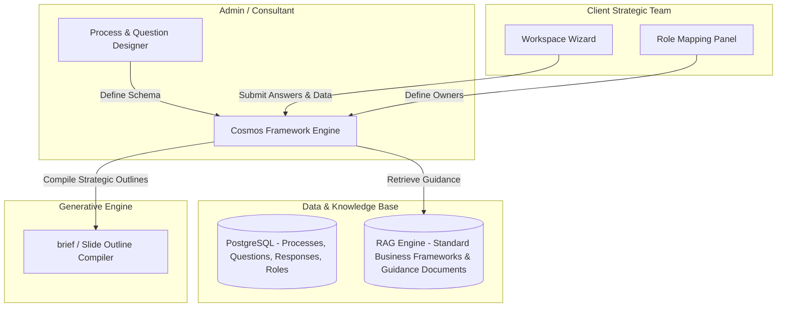

# Architecture Overview — Cosmos Strategic Capability Platform

**Last Updated:** 2026-09-05

This document describes four things: the **current POC architecture** (implemented, three-tier, Next.js + FastAPI + Neon Postgres — Section 1), the **target Framework Factory architecture** (proposed in the original pivot plan, now partially realized via Framework Authoring Mode — Section 2), the **Users, Projects & Engagement Knowledge Base** layer on Neon Postgres + pgvector (designed and now fully implemented — Section 3), and the **Guided Learning Flow** design from the Aug 24 stakeholder review (designed, two of eight items implemented — Section 4). See `documentation/product/roadmap.md` for the full, continuously-updated status, and `documentation/product/stakeholder-clarifications-2026-09.md` for open questions from a 2026-09-02 stakeholder call pending a 2026-09-09 planning session.

## 1. Current POC Architecture

### 1.1 High-Level Overview

Three-tier architecture: a Client Interface, an API Application Layer, and a single Neon Postgres database (relational tables + `pgvector` vector storage) — SQLite and the flat-file vector JSON were retired in Phase 0 (2026-08-24); the original vanilla HTML/CSS/JS frontend was retired 2026-08-27 in favor of Next.js/React.

```
 ┌────────────────────────────────────────────────────────┐
 │                   1. Presentation Layer                │
 │              Next.js (React, TypeScript) — frontend-react/ │
 └───────────────────────────┬────────────────────────────┘
                             │
                             │ REST / HTTP (JSON), JWT bearer auth
                             ▼
 ┌────────────────────────────────────────────────────────┐
 │                 2. Application API Layer               │
 │            Python FastAPI Engine (backend/main.py)     │
 │   + a second deployable service, backend/processor_main.py, │
 │     for async artifact ingestion (built, not deployed) │
 └──────┬────────────────────┬────────────────────┬───────┘
        │                    │                    │
        ▼                    ▼                    ▼
 ┌──────────────┐    ┌──────────────┐    ┌────────────────┐
 │  3a. RAG     │    │  3b. LLM     │    │  3c. SQL DB    │
 │ Embedding    │    │ Multi-provider│   │ Neon Postgres  │
 └──────┬───────┘    └──────────────┘    └────────┬───────┘
        │                                         │
        ▼                                         ▼
 ┌──────────────────────────────────────────────────────┐
 │      One Neon Postgres database (pgvector-enabled)    │
 │  framework_kb_chunks + project_kb_chunks (vectors) ·  │
 │  users/projects/project_members/responses/            │
 │  project_artifacts/calibration_* (relational)          │
 └────────────────────────────────────────────────────────┘
```

### 1.2 Component Breakdown

**Presentation Layer (`frontend-react/`)** — Next.js (React, TypeScript) app, migrated from the original vanilla HTML/CSS/JS frontend on 2026-08-27:
- Login/register, project dashboards, a New Project form, and a project setup page (industry context, artifacts, members, Framework editor, Baseline Calibration editor) for `SystemAdmin`/`Consultant`.
- The chat interview page for `ClientUser` — renders the question flow and Level 1/2/3 benchmark comparison as a split-screen workspace, with source references and a self-evaluation control.
- An `/admin` console (Users tab, Projects tab).

**Application API Layer (`backend/main.py`)** — FastAPI service:
- Routing Controller: auth, project, artifact, framework-authoring, chat-interview, and admin endpoints — see `CLAUDE.md` Part 4 for the full, current list.
- Database Manager (`backend/database.py`): Neon Postgres connection, DDL, seeding, and idempotent schema migrations.
- RAG Orchestrator (`backend/rag_engine.py`): `pgvector` search (merged across the Framework and Engagement Knowledge Bases), PDF extraction/ingestion, cosine-distance query via SQL, Level 1/2/3 comparative-benchmark prompting.
- Generative Gateway (`backend/llm_providers/`): pluggable multi-provider layer — Anthropic direct API (default), OpenAI direct API, or Gemini via Vertex AI, admin-switchable at runtime — with a local heuristic fallback when no provider is configured/available.
- A second deployable service, `backend/processor_main.py` (built, not deployed — see Section 5 and `documentation/product/roadmap.md`'s Async Artifact Ingestion Pipeline section): the Eventarc-invoked target for GCS-staged artifact processing in a deployed environment.

**Storage Layer**: one Neon Postgres database (`DATABASE_URL`), `pgvector` extension enabled:
- `processes`, `stages`, `questions`, `guidance`: process/stage/question configuration — each project now owns its own cloned copy (Framework Authoring Mode) rather than sharing one seeded set.
- `framework_kb_chunks` (`pgvector`, HNSW-indexed): the shared Framework Knowledge Base.
- `users`, `projects`, `project_members`, `responses`, `project_artifacts`, `project_kb_chunks` (`pgvector`, HNSW-indexed), `calibration_concepts`, `calibration_responses`: all live — see Section 3.

### 1.3 Core Data Flow — Guided Self-Evaluation (live, via the chat interview)

1. `POST /api/chat/sessions` starts a project-scoped interview; the first question comes from the project's own cloned process (or the calibration phase first, if the project has calibration concepts configured).
2. The user answers inline in the chat (`POST /api/chat/sessions/{id}/messages`).
3. `RagEngine.search_merged` embeds the question via `SentenceTransformer` and runs a merged `pgvector` cosine-distance query across `framework_kb_chunks` (shared) and `project_kb_chunks` (this project's own Engagement Knowledge Base), source-tagged, excluding `case_study_resolution`-purpose chunks.
4. `RagEngine.generate_comparative_benchmarks` sends the question, the user's answer, and the retrieved chunks to the active LLM provider, returning Level 1 (Superficial), Level 2 (Needs-based), and Level 3 (Insight-driven) benchmark answers.
5. The frontend displays these comparative benchmarks side-by-side with the user's own answer, sources labeled.
6. The user writes self-reflection notes, sets a self-evaluation status (Needs Work / Satisfactory / Strong), and saves — `POST /api/projects/{id}/responses`, upserted per `(question_id, project_id)` via `COALESCE`.
7. `GET /api/projects/{id}/brief` compiles all of a project's saved responses into a downloadable markdown brief.

All of the above is implemented and live — see `CLAUDE.md` Part 2 and Part 4 for the authoritative current description; this section is kept for architectural framing, not as a second source of truth for the exact contract.

## 2. Target Architecture: The Framework Factory (Largely Realized)

The original pivot insight: the slide decks (like the Madura Brand Compass) are *outputs*; the application should be the factory that configures the strategic frameworks that generate those outputs — not a hardcoded case-study critic.



This diagram uses PostgreSQL, which is no longer just a "beyond the POC" consideration — [`docs/superpowers/specs/2026-08-24-neon-postgres-pgvector-design.md`](../../docs/superpowers/specs/2026-08-24-neon-postgres-pgvector-design.md) committed to Neon Postgres + `pgvector` as the near-term target, and that migration (the `processes`/`stages`/`questions`/`guidance` tables plus the Framework Knowledge Base) is now **done** — see Section 1 and Section 3.1 below. The `Responses`/`Roles` portion of this diagram is **also done** (Phases A/B, Section 3) — every box in this diagram now corresponds to running code, not just the database.

### Proposed Data Schema & Entities

- **ManagementProcess**: `id`, `name` (e.g., "Brand Compass V2"), `description`.
- **Stage**: `id`, `process_id`, `name` (e.g., "Prepare"), `sequence_order`.
- **Question**: `id`, `stage_id`, `level` (e.g., "Level 5: Brand Relationship"), `text`, `owner_role` (e.g., "CMO"), `reviewer_role` (e.g., "CEO").
- **GuidanceModule**: `id`, `question_id`, `type` (e.g., "Matrix", "Case Study"), `content_reference`.
- **Response**: `id`, `question_id`, `client_case_id`, `submitted_text`, `submitted_data`, `self_evaluation_notes`, `self_evaluation_status`, `status` (Draft, Locked, Reviewed).

The POC's actual schema (Neon Postgres, scoped to what's needed now) is documented in full in `documentation/development/technical-spec.md` — it is the authoritative near-term schema; the entities above are the longer-term superset.

### Three Proposed Operating Modes

1. **Framework Authoring Mode** (Admin/Consultant): Process Modeler, Question & Guidance Designer, Hierarchy & Role Configurator.
2. **Framework Execution Mode** (Client Team): Dashboard, Execution Workspace, Peer Visibility Panel.
3. **Output Compilation Mode**: compiles structured inputs into a standardized consulting brief or slide outline.

**Framework Authoring Mode is now built** (2026-09-01, `backend/framework_db.py` + `/api/projects/{id}/framework/*`) — each project clones its own copy of the process/stage/question schema rather than sharing one seeded configuration; a Consultant adds/edits/reorders/deletes stages and questions before activating a project. Framework Execution Mode (above) is live via the chat interview. Multi-tenant Peer Visibility remains future work — see "Beyond the POC" in `documentation/product/roadmap.md`.

## 3. Users, Projects & Engagement Knowledge Base (Designed and Fully Built — Phases 0/A/B/C All Done)

Full design: [`docs/superpowers/specs/2026-08-24-users-projects-engagement-kb-design.md`](../../docs/superpowers/specs/2026-08-24-users-projects-engagement-kb-design.md). This is the concrete near-term implementation of the "Hierarchy & Role Configurator" and "Client Strategic Team" boxes sketched in Section 2's target diagram above — it replaces the informal `client_case_id` string with a real `Project` entity and adds the auth layer neither Section 1 nor Section 2 originally specified. All four phases (0: database platform, A: auth, B: projects, C: Engagement Knowledge Base) are done — see `documentation/product/roadmap.md`'s Foundational Work section.

### 3.1 Two Knowledge Bases, One Database

- **Framework Knowledge Base** (Section 1; **done**): the shared Cosmos methodology materials — migrated from the Brand Compass decks in `archives/` → `data/vector_db.json` (flat file) into the `framework_kb_chunks` table (`pgvector`, HNSW-indexed). One global index, common to every project.
- **Engagement Knowledge Base** (**done**, Phase C + the 2026-09-02 async ingestion pipeline): a *per-project* index of the customer's own artifacts — documents (pdf/docx/pptx/txt/md/xlsx) and meeting audio — uploaded by the Consultant running that engagement. Stored in `project_kb_chunks`, isolated per project by a `WHERE project_id = ...` clause. Case studies (external, internal, hidden resolution) are `project_artifacts` rows distinguished by a `purpose` field, not a separate entity. In a deployed environment (`GCS_ARTIFACTS_BUCKET` configured), the original file is also retained in GCS (`raw/`→`processed/`/`failed/`) rather than discarded after text extraction — see Section 5.

During evaluation, retrieval merges both via `pgvector` cosine-distance queries: the shared framework context plus whatever the consultant has ingested for this specific customer, each result tagged by source (`"framework"` vs. `"customer_document"`) so it's visible in the UI what actually informed a given AI benchmark. Chunks from a `case_study_resolution`-purpose artifact are always excluded from this automatic retrieval — see Section 4 below.

Full storage rationale and schema: [`docs/superpowers/specs/2026-08-24-neon-postgres-pgvector-design.md`](../../docs/superpowers/specs/2026-08-24-neon-postgres-pgvector-design.md).

### 3.2 Roles & Access Control

Three roles — one global, two per-project:

| Role | Scope | Does |
|---|---|---|
| `SystemAdmin` | Global (`users.is_admin`) | Creates a project, assigns its initial `Consultant`. |
| `Consultant` | Per-project | Preps the engagement (industry context, documents, case studies), activates it, assigns `ClientUser`s. |
| `ClientUser` | Per-project | Works through the learning flow — blocked entirely while the project is `Draft`. |

Simple built-in auth (email/password, JWT) — no external identity provider. A `require_project_role` dependency gates every project-scoped endpoint; someone with no `project_members` row for a project can't see it exists. A `require_active_project` dependency additionally blocks `ClientUser`s from learning-flow endpoints until the Consultant has activated the project. (Earlier drafts of this document described four per-project roles — `Owner`/`Reviewer`/`Peer` are deferred; see the Users/Projects/Engagement KB spec's Revision section.)

### 3.3 Data Flow — Onboarding a Customer Engagement

1. A **SystemAdmin** creates a `Project` (status `Draft`) against a chosen process (e.g. Brand Compass V2) and assigns a **Consultant**.
2. The **Consultant** preps the engagement: records `industry_context`, uploads reference documents, and uploads/tags the external case study, internal case study, and hidden resolution artifacts. Documents are parsed and embedded (inline locally, or via the async pipeline described in Section 5 when deployed); audio is transcribed via Google Speech-to-Text, falling back to a `Transcript Needed` status if unavailable — there is no manual-transcript-paste endpoint yet to complete that fallback (a known, named gap; see `CLAUDE.md` Part 4).
3. The Consultant assigns **ClientUser**(s) via `project_members`, then activates the project (`Draft` → `Active`).
4. From this point on, every question a **ClientUser** answers retrieves from both knowledge bases automatically — the Guided Self-Evaluation flow described in Section 1.3 is unchanged in shape, it just has richer, customer-specific context feeding it, plus the case-study reveal flow described in Section 4.

Sequencing and what depends on what: `documentation/product/roadmap.md`.

**Engagement delivery mode** (added 2026-09-05): this whole flow is what happens for `projects.delivery_mode = 'consultant_guided_async'` — the default, and the only mode with real behavior behind it. `diy_self_serve` and `live_online` are real, selectable, `CHECK`-constrained values on the same column (Consultant-editable via `PATCH /api/projects/{id}`), but architecturally undesigned — a live mode in particular would need a real-time transport and a Consultant-only insight view rather than the request/response chat model above. See `documentation/product/roadmap.md`'s "Engagement Delivery Modes" section.

## 4. Guided Learning Flow (Designed; Two of Eight Items Built)

The Aug 24 stakeholder review meeting specified the actual `ClientUser` experience in significant depth — baseline concept calibration against the organization's own definitions (**built**, 2026-09-01), adaptive question difficulty (**built**, 2026-08-26), an actionability check, keyword-agnostic mapping of jargon-free answers back to framework terms, a two-case-study resolution flow (with seeded provocations and a hidden "what they did / should have done" reveal), user-driven self-evaluation with a corpus-relative depth signal, and a module-end Start/Stop/Continue reflection where the gap between the user's approach and the organization's way becomes explicit for the first time.

This is functional/UX design, not infrastructure — full detail lives in [Functional Spec §2.3](../product/functional-spec.md#23-guided-learning-flow-clientuser), not duplicated here. The things worth noting architecturally:
- The case-study resolution reveal depends on the `purpose`-tagged artifact exclusion described in Section 3.1 — the hidden resolution is retrievable in principle but deliberately filtered out of normal retrieval until the reveal step.
- The corpus-relative depth signal requires querying across *all* historical `responses` (or a derived aggregate), not just the current project — a capability not yet reflected in the Section 3 schema's per-project scoping and not yet designed at the data-model level. Flagged here as an open gap, not solved.
- A 2026-09-02 stakeholder call raised open questions about baseline calibration's position in the flow (built as pre-question; discussed moving to post-question, or a two-point before/after design) that may change this section before the remaining items are built — see `documentation/product/stakeholder-clarifications-2026-09.md`, pending a 2026-09-09 planning session.

## 5. Async Artifact Ingestion Pipeline (Built, Not Deployed)

Landed 2026-09-02 — full design: [Async Artifact Ingestion Pipeline Spec](../../docs/superpowers/specs/2026-09-02-artifact-ingestion-pipeline-design.md). Replaces synchronous, in-memory-only Engagement Knowledge Base ingestion with a dual-mode path, live only when deployed (nothing in this repo has ever been applied to a real GCP project):

- **Local/CI (unset `GCS_ARTIFACTS_BUCKET`, the current everyday case)**: unchanged from Section 3.1/3.3 above — `POST /api/projects/{id}/artifacts` parses/embeds inline in the request, original bytes discarded.
- **Deployed (`GCS_ARTIFACTS_BUCKET` set)**: the upload endpoint instead streams bytes to `gs://cosmos-artifacts-{env}/raw/{project_id}/{artifact_id}/{filename}` (`backend/gcs_artifact_storage.py`) and returns immediately with status `Queued`. A GCS "object finalized" event, routed through Eventarc, invokes a **second deployable FastAPI service** — `backend/processor_main.py`, intended to run as Cloud Run service `cosmos-artifact-processor` — which runs the same `ingest_artifact` core (so ingestion logic is never duplicated between the two entrypoints), then moves the object to `processed/` or `failed/` and records the final status plus `gcs_object_path`. Eventarc's GCS-direct triggers have no object-name-prefix filter, so the processor's own `processed/`/`failed/` writes re-invoke it; it returns `200 skipped` for any non-`raw/` payload rather than erroring into a retry loop.
- **Infrastructure**: `infra/terraform/artifact-pipeline/` — the repo's first infrastructure-as-code (bucket, Eventarc trigger, the processor's Cloud Run service, `cosmos-backend-sa`/`cosmos-processor-sa` and their prefix-conditioned IAM). Validated (`terraform validate`/`fmt -check`) but never applied.
- `.md`/`.xlsx` were added to the supported Engagement KB formats as part of this same change (batched-row chunking for `.xlsx`, so a spreadsheet row is never split mid-row across chunks).
