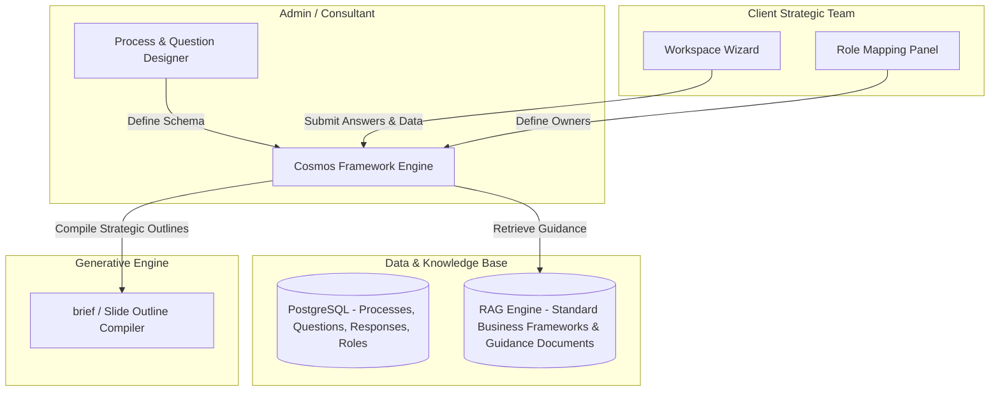

# Architecture Overview — Cosmos Strategic Capability Platform

**Last Updated:** 2026-08-24

This document describes three things: the **current POC architecture** (implemented, three-tier, SQLite-backed), the **target Framework Factory architecture** (proposed in the original pivot plan, not yet implemented), and the **Users, Projects & Engagement Knowledge Base** layer (designed, not yet implemented — Section 3) that sits between them, adding real auth and per-engagement customer artifacts. See `documentation/product/roadmap.md` for what's actually built today.

## 1. Current POC Architecture

### 1.1 High-Level Overview

Three-tier architecture: a Client Interface, an API Application Layer, and a dual-data storage subsystem (relational SQLite and vector JSON).

```
 ┌────────────────────────────────────────────────────────┐
 │                   1. Presentation Layer                │
 │             Vanilla HTML5 / CSS3 / ES6 Javascript      │
 └───────────────────────────┬────────────────────────────┘
                             │
                             │ REST / HTTP (JSON)
                             ▼
 ┌────────────────────────────────────────────────────────┐
 │                 2. Application API Layer               │
 │                   Python FastAPI Engine                │
 └──────┬────────────────────┬────────────────────┬───────┘
        │                    │                    │
        ▼                    ▼                    ▼
 ┌──────────────┐    ┌──────────────┐    ┌────────────────┐
 │  3a. RAG     │    │  3b. LLM     │    │  3c. SQL DB    │
 │ Embedding    │    │ AWS Bedrock  │    │  sqlite3 Core  │
 └──────┬───────┘    └──────────────┘    └────────┬───────┘
        │                                         │
        ▼                                         ▼
 ┌──────────────┐                        ┌────────────────┐
 │ Vector DB    │                        │  Relational DB │
 │ vector_db.json│                       │  cosmos_platform.db
 └──────────────┘                        └────────────────┘
```

### 1.2 Component Breakdown

**Presentation Layer (`frontend/`)** — single-page app using standard browser APIs:
- UI Router: toggles views (Case Select, Process Dashboard, Q&A Editor) on state transitions.
- Workspace Engine: renders stages and questions from API schema payloads.
- Self-Evaluation Module: split-screen comparative workspace next to RAG references.
- Style Engine: CSS variable tokens for dark mode and typography.

**Application API Layer (`backend/main.py`)** — FastAPI microservice:
- Routing Controller: CRUD paths for configurations and evaluation transactions.
- Database Manager (`backend/database.py`): SQLite connection, DDL, and seeding.
- RAG Orchestrator (`backend/rag_engine.py`): search indexing, PDF extraction, vector loading, distance calculation.
- Generative Gateway: talks to AWS Bedrock via `boto3` to invoke Claude models, with a local heuristic fallback when no AWS credentials are configured.

**Storage Layer (`data/`)**:
- `cosmos_platform.db` (SQLite): processes, stages, questions, guidance, and response/self-evaluation records.
- `vector_db.json` (flat file): precomputed 384-dimensional page vectors from the source consulting decks in `archives/`.

### 1.3 Core Data Flow — Workspace Q&A and Guided Self-Evaluation

1. User writes an answer for a question in a case and triggers an evaluation request.
2. The API retrieves the question's `search_query` and embeds it using `SentenceTransformer`.
3. The embedding is compared against the cached vectors in `vector_db.json` using cosine similarity.
4. The top 3 matching slide contexts are fetched.
5. The API sends the question, the user's answer, and the retrieved context slides to AWS Bedrock.
6. The LLM returns a structured JSON containing Level 1 (Superficial), Level 2 (Needs-based), and Level 3 (Insight-driven) benchmark answers, plus targeted diagnostic questions.
7. The frontend displays these comparative benchmarks to the user.
8. The user updates their response, logs self-reflection notes, sets a self-evaluation rating, and saves.
9. The backend writes the response, self-evaluation, and status to SQLite.

*(Note: steps 5-9 describe the **target** behavior once the migration checklist lands — see `documentation/product/roadmap.md`. Today, `/api/evaluate` still returns the older single `rating`/`critique`/`recommendations` shape.)*

## 2. Target Architecture: The Framework Factory (Proposed, Not Yet Built)

The original pivot insight: the slide decks (like the Madura Brand Compass) are *outputs*; the application should be the factory that configures the strategic frameworks that generate those outputs — not a hardcoded case-study critic.



This diagram uses PostgreSQL rather than the current SQLite — a multi-tenant scale consideration for **beyond the POC** (see `documentation/product/roadmap.md`). The POC deliberately stays on SQLite.

### Proposed Data Schema & Entities

- **ManagementProcess**: `id`, `name` (e.g., "Brand Compass V2"), `description`.
- **Stage**: `id`, `process_id`, `name` (e.g., "Prepare"), `sequence_order`.
- **Question**: `id`, `stage_id`, `level` (e.g., "Level 5: Brand Relationship"), `text`, `owner_role` (e.g., "CMO"), `reviewer_role` (e.g., "CEO").
- **GuidanceModule**: `id`, `question_id`, `type` (e.g., "Matrix", "Case Study"), `content_reference`.
- **Response**: `id`, `question_id`, `client_case_id`, `submitted_text`, `submitted_data`, `self_evaluation_notes`, `self_evaluation_status`, `status` (Draft, Locked, Reviewed).

The POC's actual schema (SQLite, scoped to what's needed now) is documented in full in `documentation/development/technical-spec.md` — it is the authoritative near-term schema; the entities above are the longer-term superset.

### Three Proposed Operating Modes

1. **Framework Authoring Mode** (Admin/Consultant): Process Modeler, Question & Guidance Designer, Hierarchy & Role Configurator.
2. **Framework Execution Mode** (Client Team): Dashboard, Execution Workspace, Peer Visibility Panel.
3. **Output Compilation Mode**: compiles structured inputs into a standardized consulting brief or slide outline.

Only a subset of Framework Execution Mode is in scope for the current POC (see `documentation/product/roadmap.md`); Authoring Mode and multi-tenant Peer Visibility are future work.

## 3. Users, Projects & Engagement Knowledge Base (Designed, Not Yet Built)

Full design: [`docs/superpowers/specs/2026-08-24-users-projects-engagement-kb-design.md`](../../docs/superpowers/specs/2026-08-24-users-projects-engagement-kb-design.md). This is the concrete near-term implementation of the "Hierarchy & Role Configurator" and "Client Strategic Team" boxes sketched in Section 2's target diagram above — it replaces the informal `client_case_id` string with a real `Project` entity and adds an auth layer neither Section 1 nor Section 2 specified.

### 3.1 Two Knowledge Bases

- **Framework Knowledge Base** (Section 1, implemented): the shared Cosmos methodology materials — currently the Brand Compass decks in `archives/` → `data/vector_db.json`. One global index, common to every project.
- **Engagement Knowledge Base** (new, planned): a *per-project* index of the customer's own artifacts — documents and meeting audio — uploaded by the Consultant running that engagement. Stored at `data/knowledge_base/{project_id}/vector_db.json`, isolated from every other project.

During evaluation, retrieval merges both: the shared framework context plus whatever the consultant has ingested for this specific customer, each result tagged by source (`"framework"` vs. `"customer_document"`) so it's visible in the UI what actually informed a given AI benchmark.

### 3.2 Auth & Access Control

Simple built-in auth (email/password, JWT) — no external identity provider. A `users` table backs login; a `project_members` join table assigns each user a role (`Consultant`, `Owner`, `Reviewer`, `Peer`) **per project**, not globally — the same person can be a Consultant on one engagement and a Peer on another. A `require_project_role` dependency gates every project-scoped endpoint; someone with no `project_members` row for a project can't see it exists.

### 3.3 Data Flow — Onboarding a Customer Engagement

1. A Consultant registers/logs in and creates a `Project` against a chosen process (e.g. Brand Compass V2), becoming its first member with role `Consultant`.
2. The Consultant assigns the client team (e.g. the CMO as `Owner`, the CEO as `Reviewer`) via `project_members`.
3. The Consultant uploads the customer's enterprise artifacts — prior strategy decks, financials, interview transcripts, meeting audio — into the project's Engagement Knowledge Base. Documents are parsed and embedded immediately; audio is transcribed via AWS Transcribe first (or pasted manually if AWS is unavailable).
4. From this point on, every question answered within this project retrieves from both knowledge bases automatically — the Guided Self-Evaluation flow described in Section 1.3 is unchanged, it just has richer, customer-specific context feeding it.

Sequencing and what depends on what: `documentation/product/roadmap.md`.
