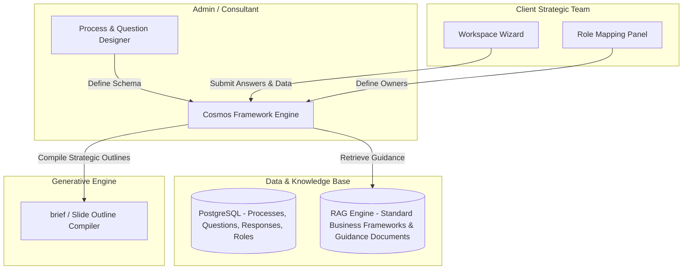

# Architecture Overview — Cosmos Strategic Capability Platform

**Last Updated:** 2026-08-24

This document describes four things: the **current POC architecture** (implemented, three-tier, now Neon Postgres-backed as of Phase 0 — Section 1), the **target Framework Factory architecture** (proposed in the original pivot plan — Section 2), the **Users, Projects & Engagement Knowledge Base** layer on Neon Postgres + pgvector (designed, mostly not yet implemented — Section 3), and the **Guided Learning Flow** design from the Aug 24 stakeholder review (designed, not yet implemented — Section 4). See `documentation/product/roadmap.md` for what's actually built today.

## 1. Current POC Architecture

### 1.1 High-Level Overview

Three-tier architecture: a Client Interface, an API Application Layer, and a single Neon Postgres database (relational tables + `pgvector` vector storage) — SQLite and the flat-file vector JSON were retired in Phase 0 (2026-08-24).

```
 ┌────────────────────────────────────────────────────────┐
 │                   1. Presentation Layer                │
 │             Vanilla HTML5 / CSS3 / ES6 Javascript      │
 └───────────────────────────┬────────────────────────────┘
                             │
                             │ REST / HTTP (JSON)
                             ▼
 ┌────────────────────────────────────────────────────────┐
 │                 2. Application API Layer               │
 │                   Python FastAPI Engine                │
 └──────┬────────────────────┬────────────────────┬───────┘
        │                    │                    │
        ▼                    ▼                    ▼
 ┌──────────────┐    ┌──────────────┐    ┌────────────────┐
 │  3a. RAG     │    │  3b. LLM     │    │  3c. SQL DB    │
 │ Embedding    │    │ Multi-provider│   │ Neon Postgres  │
 └──────┬───────┘    └──────────────┘    └────────┬───────┘
        │                                         │
        ▼                                         ▼
 ┌──────────────────────────────────────────────────────┐
 │      One Neon Postgres database (pgvector-enabled)    │
 │  framework_kb_chunks (vectors) · processes/stages/    │
 │  questions/guidance (relational)                       │
 └────────────────────────────────────────────────────────┘
```

### 1.2 Component Breakdown

**Presentation Layer (`frontend/`)** — single-page app using standard browser APIs:
- UI Router: toggles views (Case Select, Process Dashboard, Q&A Editor) on state transitions.
- Workspace Engine: renders stages and questions from API schema payloads.
- Self-Evaluation Module: split-screen comparative workspace next to RAG references.
- Style Engine: CSS variable tokens for dark mode and typography.

**Application API Layer (`backend/main.py`)** — FastAPI microservice:
- Routing Controller: CRUD paths for configurations and evaluation transactions.
- Database Manager (`backend/database.py`): Neon Postgres connection, DDL, and seeding.
- RAG Orchestrator (`backend/rag_engine.py`): `pgvector` search, PDF extraction/ingestion, cosine-distance query via SQL.
- Generative Gateway (`backend/llm_providers/`): pluggable multi-provider layer — Anthropic direct API (default), OpenAI direct API, or Gemini via Vertex AI, admin-switchable at runtime — with a local heuristic fallback when no provider is configured/available.

**Storage Layer**: one Neon Postgres database (`DATABASE_URL`), `pgvector` extension enabled:
- `processes`, `stages`, `questions`, `guidance`: seeded process/stage/question configuration.
- `framework_kb_chunks` (`pgvector`, HNSW-indexed): precomputed 384-dimensional slide vectors from the source consulting decks in `archives/`.
- No `responses` table exists yet — response/self-evaluation persistence lands in Phase B (see `documentation/product/roadmap.md`).

### 1.3 Core Data Flow — Workspace Q&A and Guided Self-Evaluation

1. User writes an answer for a question in a case and triggers an evaluation request.
2. The API retrieves the question's `search_query` and embeds it using `SentenceTransformer`.
3. The embedding is compared against `framework_kb_chunks` rows via a `pgvector` cosine-distance query.
4. The top 3 matching slide contexts are fetched.
5. The API sends the question, the user's answer, and the retrieved context slides to the active LLM provider.
6. The LLM returns a structured JSON containing Level 1 (Superficial), Level 2 (Needs-based), and Level 3 (Insight-driven) benchmark answers, plus targeted diagnostic questions.
7. The frontend displays these comparative benchmarks to the user.
8. The user updates their response, logs self-reflection notes, sets a self-evaluation rating, and saves.
9. The backend writes the response, self-evaluation, and status to a `responses` table.

*(Note: steps 1-3 are implemented, on Neon Postgres + `pgvector`, as of Phase 0. Steps 5-9 describe **target** behavior once the migration checklist lands — see `documentation/product/roadmap.md`. Today, `/api/evaluate` still returns the older single `rating`/`critique`/`recommendations` shape, and step 9's `responses` table doesn't exist yet — it lands in Phase B.)*

## 2. Target Architecture: The Framework Factory (Proposed, Not Yet Built)

The original pivot insight: the slide decks (like the Madura Brand Compass) are *outputs*; the application should be the factory that configures the strategic frameworks that generate those outputs — not a hardcoded case-study critic.



This diagram uses PostgreSQL, which is no longer just a "beyond the POC" consideration — [`docs/superpowers/specs/2026-08-24-neon-postgres-pgvector-design.md`](../../docs/superpowers/specs/2026-08-24-neon-postgres-pgvector-design.md) committed to Neon Postgres + `pgvector` as the near-term target, and Phase 0 of that migration (the `processes`/`stages`/`questions`/`guidance` tables plus the Framework Knowledge Base) is now **done** — see Section 1 and Section 3.1 below. The `Responses`/`Roles` portion of this diagram is still target-only (Phases A/B).

### Proposed Data Schema & Entities

- **ManagementProcess**: `id`, `name` (e.g., "Brand Compass V2"), `description`.
- **Stage**: `id`, `process_id`, `name` (e.g., "Prepare"), `sequence_order`.
- **Question**: `id`, `stage_id`, `level` (e.g., "Level 5: Brand Relationship"), `text`, `owner_role` (e.g., "CMO"), `reviewer_role` (e.g., "CEO").
- **GuidanceModule**: `id`, `question_id`, `type` (e.g., "Matrix", "Case Study"), `content_reference`.
- **Response**: `id`, `question_id`, `client_case_id`, `submitted_text`, `submitted_data`, `self_evaluation_notes`, `self_evaluation_status`, `status` (Draft, Locked, Reviewed).

The POC's actual schema (Neon Postgres, scoped to what's needed now) is documented in full in `documentation/development/technical-spec.md` — it is the authoritative near-term schema; the entities above are the longer-term superset.

### Three Proposed Operating Modes

1. **Framework Authoring Mode** (Admin/Consultant): Process Modeler, Question & Guidance Designer, Hierarchy & Role Configurator.
2. **Framework Execution Mode** (Client Team): Dashboard, Execution Workspace, Peer Visibility Panel.
3. **Output Compilation Mode**: compiles structured inputs into a standardized consulting brief or slide outline.

Only a subset of Framework Execution Mode is in scope for the current POC (see `documentation/product/roadmap.md`); Authoring Mode and multi-tenant Peer Visibility are future work.

## 3. Users, Projects & Engagement Knowledge Base (Designed; Phase 0 Done, Phases A/B/C Not Yet Built)

Full design: [`docs/superpowers/specs/2026-08-24-users-projects-engagement-kb-design.md`](../../docs/superpowers/specs/2026-08-24-users-projects-engagement-kb-design.md). This is the concrete near-term implementation of the "Hierarchy & Role Configurator" and "Client Strategic Team" boxes sketched in Section 2's target diagram above — it replaces the informal `client_case_id` string with a real `Project` entity and adds an auth layer neither Section 1 nor Section 2 specified. Of this section, only the database platform move (Phase 0) is built; Users, Projects, and the Engagement Knowledge Base itself (Phases A/B/C) are designed but not implemented.

### 3.1 Two Knowledge Bases, One Database

- **Framework Knowledge Base** (Section 1; **done** as of Phase 0): the shared Cosmos methodology materials — migrated from the Brand Compass decks in `archives/` → `data/vector_db.json` (flat file) into the `framework_kb_chunks` table (`pgvector`, HNSW-indexed). One global index, common to every project.
- **Engagement Knowledge Base** (new, planned): a *per-project* index of the customer's own artifacts — documents and meeting audio — uploaded by the Consultant running that engagement. Target storage is the `project_kb_chunks` table, isolated per project by a `WHERE project_id = ...` clause rather than by which flat file happens to be open. Case studies (external, internal, hidden resolution) are `project_artifacts` rows distinguished by a `purpose` field, not a separate entity.

During evaluation, retrieval merges both via `pgvector` cosine-distance queries: the shared framework context plus whatever the consultant has ingested for this specific customer, each result tagged by source (`"framework"` vs. `"customer_document"`) so it's visible in the UI what actually informed a given AI benchmark. Chunks from a `case_study_resolution`-purpose artifact are always excluded from this automatic retrieval — see Section 4 below.

Full storage rationale and schema: [`docs/superpowers/specs/2026-08-24-neon-postgres-pgvector-design.md`](../../docs/superpowers/specs/2026-08-24-neon-postgres-pgvector-design.md).

### 3.2 Roles & Access Control

Three roles — one global, two per-project:

| Role | Scope | Does |
|---|---|---|
| `SystemAdmin` | Global (`users.is_admin`) | Creates a project, assigns its initial `Consultant`. |
| `Consultant` | Per-project | Preps the engagement (industry context, documents, case studies), activates it, assigns `ClientUser`s. |
| `ClientUser` | Per-project | Works through the learning flow — blocked entirely while the project is `Draft`. |

Simple built-in auth (email/password, JWT) — no external identity provider. A `require_project_role` dependency gates every project-scoped endpoint; someone with no `project_members` row for a project can't see it exists. A `require_active_project` dependency additionally blocks `ClientUser`s from learning-flow endpoints until the Consultant has activated the project. (Earlier drafts of this document described four per-project roles — `Owner`/`Reviewer`/`Peer` are deferred; see the Users/Projects/Engagement KB spec's Revision section.)

### 3.3 Data Flow — Onboarding a Customer Engagement

1. A **SystemAdmin** creates a `Project` (status `Draft`) against a chosen process (e.g. Brand Compass V2) and assigns a **Consultant**.
2. The **Consultant** preps the engagement: records `industry_context`, uploads reference documents, and uploads/tags the external case study, internal case study, and hidden resolution artifacts. Documents are parsed and embedded immediately into `project_kb_chunks`; audio is transcribed via Google Speech-to-Text first (or pasted manually if the provider is unavailable).
3. The Consultant assigns **ClientUser**(s) via `project_members`, then activates the project (`Draft` → `Active`).
4. From this point on, every question a **ClientUser** answers retrieves from both knowledge bases automatically — the Guided Self-Evaluation flow described in Section 1.3 is unchanged in shape, it just has richer, customer-specific context feeding it, plus the case-study reveal flow described in Section 4.

Sequencing and what depends on what: `documentation/product/roadmap.md`.

## 4. Guided Learning Flow (Designed, Not Yet Built)

The Aug 24 stakeholder review meeting specified the actual `ClientUser` experience in significant depth — baseline concept calibration against the organization's own definitions, adaptive question difficulty, an actionability check, keyword-agnostic mapping of jargon-free answers back to framework terms, a two-case-study resolution flow (with seeded provocations and a hidden "what they did / should have done" reveal), user-driven self-evaluation with a corpus-relative depth signal, and a module-end Start/Stop/Continue reflection where the gap between the user's approach and the organization's way becomes explicit for the first time.

This is functional/UX design, not infrastructure — full detail lives in [Functional Spec §2.3](../product/functional-spec.md#23-guided-learning-flow-clientuser), not duplicated here. The two things worth noting architecturally:
- The case-study resolution reveal depends on the `purpose`-tagged artifact exclusion described in Section 3.1 — the hidden resolution is retrievable in principle but deliberately filtered out of normal retrieval until the reveal step.
- The corpus-relative depth signal requires querying across *all* historical `responses` (or a derived aggregate), not just the current project — a capability not yet reflected in the Section 3 schema's per-project scoping and not yet designed at the data-model level. Flagged here as an open gap, not solved.
