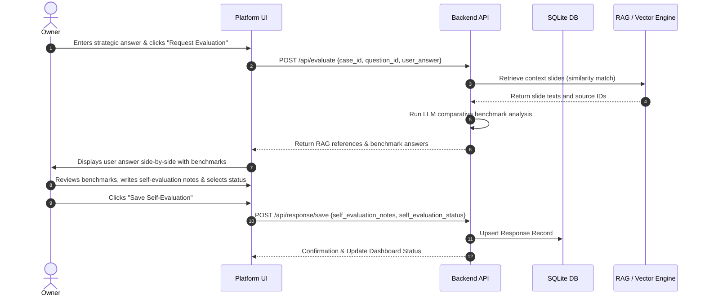

# Functional Specification — Cosmos Strategic Capability Platform

---

## 1. User Roles & Hierarchy

The platform supports four primary user personas with distinct permissions and interactive capabilities:

```
┌─────────────────────────────────────────────────────────────┐
│                       User Persona Permissions              │
├──────────────────────┬──────────────────────────────────────┤
│ Role                 │ Permitted Actions                    │
├──────────────────────┼──────────────────────────────────────┤
│ Admin / Consultant   │ Author processes, questions, stages. │
│ Owner (e.g., CMO)    │ Submits answers, self-evaluates.     │
│ Reviewer (e.g., CEO) │ Reviews locked answers, adds feedback│
│ Peer (e.g., COO)     │ Read-only view of locked answers.    │
└──────────────────────┴──────────────────────────────────────┘
```

---

## 2. Core Functional Modes

### 2.1 Framework Authoring Mode (Admin/Consultant Interface)
Allows facilitators or client administrators to define the strategic process.
* **Process Modeler**: Create, read, update, and delete strategic processes (e.g. "Madura Brand Compass V2").
* **Stage Builder**: Define the chronological sequence of stages (e.g. Aim, Opportunity, Consumer, Insights).
* **Question & Guidance Designer**:
  * Input the "restlessness-arousing" questions.
  * Assign a target ownership role (who answers) and a reviewer role (who signs off).
  * Attach guidance modules (text explanations, matrices, case studies, or slide templates).

### 2.2 Framework Execution Mode (Client Workspace)
The execution workspace where corporate teams perform their strategic analysis.
* **Case Selector**: Pick an active business case/project (e.g., "Blazar Hair Care Entry").
* **Dashboard / Progress Wizard**: Displays status indicators for each stage and question (e.g. *Not Started, Draft, Submitted, Self-Evaluated, Approved*).
* **Q&A Execution Workspace**:
  * Displays the question and its associated guidance.
  * Input field for answers (text and data arrays).
* **Guided Self-Evaluation Interface**:
  * Triggers when the user clicks "Evaluate Answer".
  * Surfaces comparative benchmark responses retrieved via RAG.
  * Captures the user's **Self-Evaluation Notes** and **Self-Evaluation Rating** (*Needs Work, Satisfactory, Strong*).
* **Peer Visibility Panel**: Shows locked, submitted answers of peers to drive reputational accountability without enabling online comments (forcing one-on-one collaboration).

### 2.3 Output Compilation Mode (Brief Compiler)
* Gathers all final responses, matrices, and evaluations from a completed process.
* Compiles the data into a downloadable, structured **Strategic Briefing Document** (formatted in Markdown or HTML) which outlines the slide decks/outputs.

---

## 3. Detailed Workflows

### 3.1 Guided Self-Evaluation Workflow



---

## 4. UI/UX General Requirements

* **Premium Theme**: Clean dark/light mode with a high-contrast layout, HSL color tokens, and Google Fonts integration (Outfit or Inter).
* **Side-by-Side Comparison Workspace**: Split-screen view during self-evaluation to ensure user response, retrieved slides, and LLM-generated comparative benchmarks are viewable together.
* **Micro-Animations**: Hover states, slide transitions, and loading skeletons while LLM benchmarks are being fetched.
