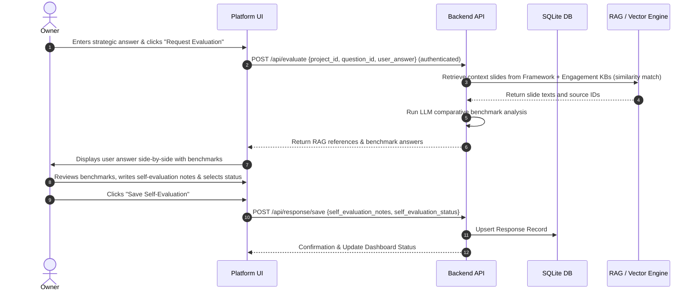

# Functional Specification — Cosmos Strategic Capability Platform

---

**Note (2026-08-24):** the "case" language throughout this document (e.g. "business case/project" in 2.2) is being formalized as a first-class **Project** entity, with the four roles below enforced via real login rather than being conceptual. Full design: [`docs/superpowers/specs/2026-08-24-users-projects-engagement-kb-design.md`](../../docs/superpowers/specs/2026-08-24-users-projects-engagement-kb-design.md). Not yet built — see `documentation/product/roadmap.md`.

## 1. User Roles & Hierarchy

The platform supports four primary user personas with distinct permissions and interactive capabilities. These are enforced **per project** — the same person can hold different roles on different engagements (e.g. Consultant on one, Peer observer on another):

```
┌─────────────────────────────────────────────────────────────┐
│                       User Persona Permissions              │
├──────────────────────┬──────────────────────────────────────┤
│ Role                 │ Permitted Actions                    │
├──────────────────────┼──────────────────────────────────────┤
│ Admin / Consultant   │ Author processes, questions, stages. │
│ Owner (e.g., CMO)    │ Submits answers, self-evaluates.     │
│ Reviewer (e.g., CEO) │ Reviews locked answers, adds feedback│
│ Peer (e.g., COO)     │ Read-only view of locked answers.    │
└──────────────────────┴──────────────────────────────────────┘
```

---

## 2. Core Functional Modes

### 2.1 Framework Authoring Mode (Admin/Consultant Interface)
Allows facilitators or client administrators to define the strategic process.
* **Process Modeler**: Create, read, update, and delete strategic processes (e.g. "Madura Brand Compass V2").
* **Stage Builder**: Define the chronological sequence of stages (e.g. Aim, Opportunity, Consumer, Insights).
* **Question & Guidance Designer**:
  * Input the "restlessness-arousing" questions.
  * Assign a target ownership role (who answers) and a reviewer role (who signs off).
  * Attach guidance modules (text explanations, matrices, case studies, or slide templates).

### 2.2 Framework Execution Mode (Client Workspace)
The execution workspace where corporate teams perform their strategic analysis. Requires login; a user only sees projects they're a member of.
* **Project Dashboard**: Pick an active project/engagement (e.g., "Blazar Hair Care Entry") from the projects the logged-in user belongs to.
* **Dashboard / Progress Wizard**: Displays status indicators for each stage and question (e.g. *Not Started, Draft, Submitted, Self-Evaluated, Approved*).
* **Q&A Execution Workspace**:
  * Displays the question and its associated guidance.
  * Input field for answers (text and data arrays).
* **Guided Self-Evaluation Interface**:
  * Triggers when the user clicks "Evaluate Answer".
  * Surfaces comparative benchmark responses retrieved via RAG, drawing on both the shared Framework Knowledge Base and this project's own Engagement Knowledge Base (see 2.4) — each cited slide/snippet labeled by source.
  * Captures the user's **Self-Evaluation Notes** and **Self-Evaluation Rating** (*Needs Work, Satisfactory, Strong*).
* **Peer Visibility Panel**: Shows locked, submitted answers of peers to drive reputational accountability without enabling online comments (forcing one-on-one collaboration).

### 2.3 Output Compilation Mode (Brief Compiler)
* Gathers all final responses, matrices, and evaluations from a completed process.
* Compiles the data into a downloadable, structured **Strategic Briefing Document** (formatted in Markdown or HTML) which outlines the slide decks/outputs.

### 2.4 Engagement Knowledge Base (Consultant Interface)

Lets the Consultant leading an engagement bring the customer's own materials into the platform so guidance and benchmarks reflect this specific customer, not just the generic Cosmos framework decks.

* **Artifact Upload**: Consultant-only. Accepts documents (PDF, Word, PowerPoint) and meeting audio, scoped to the current project only — never shared with other engagements.
* **Artifact Status List**: Shows each uploaded artifact's ingestion status (*Uploaded, Processing, Indexed, Failed, Transcript Needed*). Audio that couldn't be auto-transcribed prompts the consultant to paste a transcript manually rather than failing silently.
* **Transparent retrieval**: once indexed, an artifact's content is automatically available to the Guided Self-Evaluation Interface (2.2) — there's no separate search step during the workshop itself.

---

## 3. Detailed Workflows

### 3.1 Guided Self-Evaluation Workflow



---

## 4. UI/UX General Requirements

* **Premium Theme**: Clean dark/light mode with a high-contrast layout, HSL color tokens, and Google Fonts integration (Outfit or Inter).
* **Side-by-Side Comparison Workspace**: Split-screen view during self-evaluation to ensure user response, retrieved slides, and LLM-generated comparative benchmarks are viewable together.
* **Micro-Animations**: Hover states, slide transitions, and loading skeletons while LLM benchmarks are being fetched.
