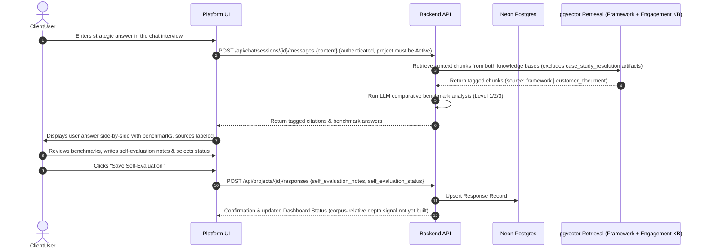
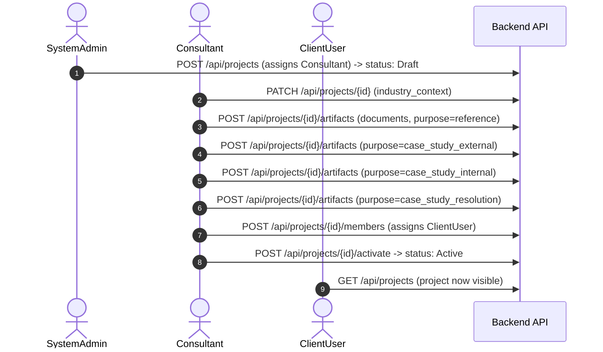

# Functional Specification — Cosmos Strategic Capability Platform

**Last Updated:** 2026-09-05 (status corrections only — §2.3 content unchanged since 2026-08-26)

---

**Provenance note**: the learning-flow detail in section 2.3 below comes directly from a stakeholder review meeting (transcript: `archives/Meeting transcript 24Aug.txt`) walking through the Insights module's intended experience in depth. It is materially more detailed than the version of this document that existed before 2026-08-24 — this is a rewrite, not an incremental edit. Full technical design: [Users/Projects/Engagement KB Spec](../../docs/superpowers/specs/2026-08-24-users-projects-engagement-kb-design.md) (roles, project lifecycle) and [Neon Postgres + pgvector Spec](../../docs/superpowers/specs/2026-08-24-neon-postgres-pgvector-design.md) (storage). **Status**: sections 2.3(a) (baseline calibration) and 2.3(c) (adaptive question difficulty) are built; the rest of 2.3 (2.3d–i) is not — see `documentation/product/roadmap.md`'s Guided Learning Flow checklist. A 2026-09-02 follow-up call raised open questions that may change 2.3(a)'s design (calibration's position in the flow) and 2.2's document-upload assumptions before further work proceeds — see `documentation/product/stakeholder-clarifications-2026-09.md`, pending a 2026-09-09 planning session.

---

## 1. User Roles & Hierarchy

Three roles, one of them global and two per-project:

```
┌───────────────────────────────────────────────────────────────────────┐
│                         User Roles                                    │
├───────────────┬─────────┬─────────────────────────────────────────────┤
│ Role          │ Scope   │ Does                                        │
├───────────────┼─────────┼─────────────────────────────────────────────┤
│ SystemAdmin   │ Global  │ Creates projects, assigns the leading        │
│               │         │ Consultant.                                 │
│ Consultant    │ Project │ Preps the engagement (industry context,      │
│               │         │ documents, case studies), activates it,     │
│               │         │ assigns ClientUsers.                        │
│ ClientUser    │ Project │ Works through the learning flow: answers     │
│               │         │ questions, solves case studies, self-        │
│               │         │ evaluates.                                  │
└───────────────┴─────────┴─────────────────────────────────────────────┘
```

**Note on scope**: earlier drafts of this document described `Owner`/`Reviewer`/`Peer` as three separate client-side roles. That's deferred in favor of a single `ClientUser` role for the POC — the sign-off and read-only-visibility workflows those implied still matter to the product vision, they're just not needed to build the core one-on-one loop described below. See the Users/Projects/Engagement KB Spec's Out of Scope section.

---

## 2. Core Functional Modes

### 2.1 Project Setup (SystemAdmin)

- Creates a project: name, customer name, which process/module it runs (e.g. Insights), and who leads it.
- Assigns a `Consultant` to the project. A project starts in `Draft` status — invisible and inaccessible to any `ClientUser` until the Consultant activates it.
- **Engagement delivery mode** (added 2026-09-05): every project has a `delivery_mode` — `consultant_guided_async` (default, the only one with real behavior behind it), `diy_self_serve`, or `live_online` — editable by the Consultant on the project setup page. The other two modes are undesigned; selecting them today just records the intent. See `documentation/product/roadmap.md`'s "Engagement Delivery Modes" section.

### 2.2 Engagement Preparation (Consultant)

Everything the Consultant does *before* a workshop starts — matches the meeting's clear distinction between prep work and the live/async learning experience.

- **Industry context**: records notes on the client's industry and B2B vs. B2C positioning. This calibrates question language and example selection — per the meeting, this divergence has only actually been observed in the Sales/Business Development module, not in Brand, Innovation, or Communication. **Deliberately not** deep company research: "all the information that is relevant should always be salient in the people's minds" — the system doesn't try to pre-load company-specific knowledge beyond what the client team itself brings.
- **Document upload**: uploads the client's own artifacts (prior strategy decks, financials, interview notes, meeting audio) into the project's Engagement Knowledge Base — see the Users/Projects/Engagement KB Spec. **Open question (2026-09-02 call)**: whether this stays consultant-upload-driven for company-background material, or shifts toward publicly-available-information research instead — see `documentation/product/stakeholder-clarifications-2026-09.md`. Case study authoring below is not in question either way.
- **Case study authoring** — two case studies per module, both prepared by the Consultant, not left to individual ClientUsers to invent:
  - **External case study**: a hypothetical, "off-category" scenario unrelated to the client's actual business — no intimacy, provided data only, so the ClientUser reasons from what's given rather than personal familiarity. **New requirement, not yet built (added 2026-09-05)**: rather than uploading one from scratch per project, the Consultant should be able to **select** this from a reusable, Cosmos-owned case study repository/library — formalizing what Balaji asked Ashutosh for on the 2 Sept call (a list of case studies to pick from at setup). See `documentation/product/roadmap.md`'s "Cosmos-Owned Content Repositories" section.
  - **Internal case study**: the client's real, current, unsolved business problem — supplied by the organization (not each individual user), since a workshop can't rely on many separate users each proposing their own case.
  - **Hidden resolution**: for each case study, the Consultant also prepares (or has the platform help draft) a resolution — what the organization actually did, and what they should have done per Cosmos's frameworks. This stays hidden from the ClientUser until after they've submitted their own answer.
  - **Seeded provocations**: a short battery of 4-5 "big thought" perspectives per internal case study, prepared ahead of time, used to trigger deeper thinking during the case study discussion — this stands in for what a live facilitator does by embedding themselves in a workshop breakout group to push thinking from inside rather than lecturing.
- **Assign ClientUsers**, then **activate** the project (`Draft` → `Active`).

### 2.3 Guided Learning Flow (ClientUser)

The core one-on-one experience — confirmed explicitly as one-on-one, not group/workshop, in the review meeting (whether it can *also* work as a live-workshop tool is an open, separately-tracked question, not designed here). Framed like a short course (e.g. "a six-hour desk job" for the Insights module), reached via login.

**a. Baseline calibration (first, before any questions)**

The system asks the ClientUser to define a handful of core concepts for the module (e.g. for Insights: what is an insight? what is a brand? what's the difference between innovation and incremental? what is strategy?). This is **not** a right/wrong debate — it's scored against *this organization's own* definitions of those terms (drawn from the Consultant's uploaded materials), framed constructively (e.g. "your understanding is already close to how this organization defines it"). The point is alignment on the org's specific language, not correcting the user's general knowledge.

**b. Per-question flow**

For each restlessness-arousing question:
1. Theory/nuance in simple language.
2. 1-2 real-world examples of brands/businesses that appear to have handled this well — limited to what's **deducible from externally observable, customer-facing material** (ads, product, packaging), never from internal case studies or Harvard-style write-ups. Sector can lightly bias example selection (roughly 10-15% of examples drawn from the client's own category, not more — enough to feel relevant without becoming "too close to home").
3. Two exercises: one **serious** (e.g. analyze 4-5 real brands against the concept) and one **fun/demystifying** (e.g. "was choosing to join this call instead of doing something else a strategic or tactical choice?") — the fun exercise exists specifically to strip the concept of jargon and show it's not abstract.
4. No forced right answer on exercises: the system offers its own answer + rationale; the user can agree, disagree, or ignore, with a limited AI-mediated back-and-forth — framed as a moment of reflection, never as litigation over who's right.

**c. Adaptive question difficulty**

If a user pushes back that a question is "too easy" or "we've heard this a hundred times," the system probes with a concrete prompt (e.g. "what would the answer be for your brand?"). If that probe answer is genuinely sophisticated, the question can evolve to arouse more restlessness; if it comes back generic, the system holds firm that the original question is still apt. Guardrails apply — this isn't unlimited escalation.

**Sharpened in the 2026-08-26 review meeting** (transcript: `archives/Meeting Min 26Aug.txt`): the **master/anchor question for each level is fixed, human-authored content — Consultant IP, never reworded by the AI**. Only the follow-up drill-down that happens *after* the user's initial answer is AI-generated: if the answer doesn't yet show sufficient depth, the system keeps probing with further AI-formulated follow-ups — "it will not move till you have done justice to the work" — rather than accepting a shallow first pass and moving on. **Built** — verbatim master questions plus a probe-then-escalate follow-up loop landed the same day (commit `50a9280`); `backend/chat_engine.py` presents the canonical question text as-is rather than having the LLM rephrase it.

**d. Actionability check**

The system pushes back on eloquent-but-vague answers ("this may be a great input for a book, but how would you actually deploy it?") — demanding a concrete, followable next step rather than accepting polish as substance.

**e. Keyword-agnostic answer mapping**

Critical requirement from the meeting: the system must **never** under-score an answer for lacking jargon. A conceptually sound answer given in plain language should be explicitly mapped back to the framework's terms ("here's how what you said maps to our principles") — so the user sees their answer was actually strong, rather than assuming it was wrong because it didn't "look like" the model answer.

**f. Case study resolution**

After a section's questions (typically 3-6), the user solves the **external** case study, then the **internal** one. For each: the user submits their answer, then the hidden resolution (prepared in 2.2) is revealed — what the organization actually did, and what they should have done. A limited, token/interaction-capped AI-mediated debate follows, framed around **insufficiency, not right/wrong** — especially important for the internal case study, where users are more likely to become defensive since it's their own real business problem being discussed with a machine rather than a human moderator. The seeded provocations from 2.2 are available to the system to trigger deeper thinking if the user's answer is shallow.

**g. Self-evaluation — user-driven, with a corpus-relative signal**

Confirmed explicitly: **the system does not grade the user.** The self-evaluation report card is generated by the user, not the system (rating themselves on dimensions like depth, framework adherence, etc.). What the system *does* add: a relative signal computed against the full historical database of answers across the platform — e.g. "you rated yourself 4/5, but on depth of answer, similar answers in the database tend to fall around 2/5" — framed as a constructive nudge ("you might want to work through a few more examples"), never as an adversarial evaluation.

**h. Org-way gap surfacing — implied per-question, explicit at module end**

Per-question, if a user's answer diverges from what this organization's own frameworks emphasize (e.g. staying at a surface "behavioral insight" level when the org's Insight Spiral tool expects the user to reach cultural/societal levels too), the gap stays **salient but implied** — the system nudges toward completeness ("have you considered the cultural dimension?") without ever stating "you did this wrong." Making it explicit mid-flow risks the user becoming defensive, exactly as it would in a live workshop.

Only at the **end of a module** does the gap become explicit, framed as a **Start / Stop / Continue** reflection: "based on this module, what will you start doing, stop doing, and continue doing?" This is the one moment the platform is allowed to make the gap plain — because it's framed as the user's own realization and commitment, not a verdict.

**i. Human escalation, by exception**

An optional, extra-cost path to a short (~20 minute) live discussion with a human consultant, offered when a user's trajectory diverges significantly from what's expected across several sections — analogous to a chatbot escalating to a human agent. Not expected to be used often; provided as a safety valve, not a core flow.

### 2.4 Output Compilation Mode (Brief Compiler)

- Gathers all final responses, case study resolutions, and Start/Stop/Continue reflections from a completed process.
- Compiles the data into a downloadable, structured **Strategic Briefing Document** (Markdown or HTML).

---

## 3. Detailed Workflows

### 3.1 Guided Self-Evaluation Workflow

**Note on the diagram below**: it's conceptually accurate but predates the actual endpoint names — the live flow runs through the project-scoped chat interview (`POST /api/chat/sessions`, `POST /api/chat/sessions/{id}/messages`), not a single-shot `POST /api/evaluate`/`POST /api/response/save` pair. The comparative-benchmark generation and merged retrieval those calls invoke internally (`RagEngine.search_merged`, `RagEngine.generate_comparative_benchmarks`) match what's described here; self-evaluation is persisted via `POST /api/projects/{id}/responses`. See `CLAUDE.md` Part 4 for the current, authoritative endpoint list. The corpus-relative depth signal at the end is still not built — see the Guided Learning Flow checklist.



### 3.2 Engagement Preparation Workflow (new)



---

## 4. UI/UX General Requirements

* **Premium Theme**: Clean dark/light mode with a high-contrast layout, HSL color tokens, and Google Fonts integration (Outfit or Inter).
* **Side-by-Side Comparison Workspace**: Split-screen view during self-evaluation to ensure user response, retrieved context (source-labeled), and LLM-generated comparative benchmarks are viewable together.
* **Micro-Animations**: Hover states, slide transitions, and loading skeletons while LLM benchmarks are being fetched.
* **Non-adversarial tone throughout**: every system-generated nudge (baseline calibration, actionability check, org-way gap surfacing, corpus-relative depth signal) must read as constructive reflection, never as grading or correction. This is a recurring, explicit requirement across the review meeting, not a one-off detail — worth treating as a design principle for any future copy in this flow.

---

## 5. Long-Term Product Vision (context, not POC scope)

The review meeting situated the Insights module (everything above) as the first of **five planned modules**, sharing the same underlying corpus/framework engine but with dramatically different user experiences:

1. **Capability Building** (this document's scope — the Insights POC).
2. **Management Process Building**.
3. **Organization Transparency Building**.
4. **Performance & Potential Evaluation**.
5. **DIY Consulting**.

Per the meeting: "if the same corpus can lead to four or five different business ideas, then it has far more legs to travel on without much additional effort" — the five modules aren't independent products, they're different lenses on one system. None of modules 2-5 are designed yet; a follow-up stakeholder call is scheduled to go deeper into them. This section exists so that Insights-module decisions aren't made in a vacuum that later turns out to conflict with the other four.
