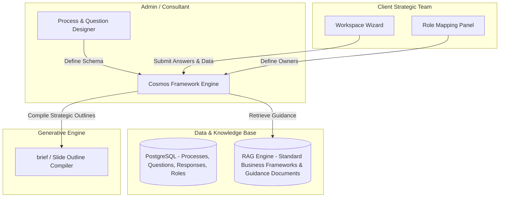

# Implementation Plan — Cosmos Strategic Capability Platform (Framework Builder)

This plan overhauls the Cosmos platform concept based on the critical insight: **the slide decks (like Madura Brand Compass) are outputs; the application must be the factory that configures the strategic frameworks from which these outputs are generated.**

---

## User Review Required

> [!IMPORTANT]
> - **POC Scope**: The initial implementation is scoped to the **Insights Module** (or "Beginning through Insights") as a POC to validate the product concept before building the full platform.
> - **Interactive Process**: We are shifting from a static "Q&A critic" to an **interactive process authoring and execution engine**. We need your feedback on the proposed stage builder, role hierarchy mapping, and document generation pipeline.

---

## Proposed Platform Concept: The Framework Factory

Instead of hardcoding cases (Blazar/Basil) or critique rubrics, the platform will support:

1. **Framework Authoring Mode (The Consultant/Admin Interface)**:
   * **Process Modeler**: Design strategic processes (e.g., "Brand Compass", "Innovation Funnel") divided into stages (e.g., Aim, Prepare, Position).
   * **Question & Guidance Designer**: Author the "restlessness-arousing" questions for each stage. Define who owns the question, who answers, and attach guidance modules (e.g., formulas, matrices, mini-cases).
   * **Hierarchy & Role Configurator**: Assign questions to specific organizational roles (CEO, CMO, Brand Manager, Purchaser) to automatically map the hierarchy.

2. **Framework Execution Mode (The Client Team Interface)**:
   * **Dashboard**: Displays a dashboard of the active process, indicating question status, ownership, and peer review progress.
   * **Execution Workspace**: The assigned owner inputs their strategic data and analysis for their questions, assisted by RAG-retrieved guidance notes.
   * **Peer Visibility Panel**: Peers can view locked answers to establish reputational accountability, with structured one-on-one feedback channels.

3. **Output Compilation Mode (The Generation Engine)**:
   * Compiles the structured data inputs, matrices, and text answers into a standardized consulting brief or slide outline (shaping the final outputs like the Madura decks).

---

## Proposed System Architecture

---

## Data Schema & Entities (Proposed)

* **ManagementProcess**: `id`, `name` (e.g., "Brand Compass V2"), `description`.
* **Stage**: `id`, `process_id`, `name` (e.g., "Prepare"), `sequence_order`.
* **Question**: `id`, `stage_id`, `level` (e.g., "Level 5: Brand Relationship"), `text` (the restlessness-arousing prompt), `owner_role` (e.g., "CMO"), `reviewer_role` (e.g., "CEO").
* **GuidanceModule**: `id`, `question_id`, `type` (e.g., "Matrix", "Case Study"), `content_reference` (links to framework templates like the FBV ladder).
* **Response**: `id`, `question_id`, `client_case_id`, `submitted_text`, `submitted_data` (structured inputs), `self_evaluation_notes` (user's self-judgment against comparative benchmarks), `self_evaluation_status` (e.g., Needs Work, Satisfactory, Strong), `status` (Draft, Locked, Reviewed).

---

## Verification Plan (POC Scoped)

### Automated Tests
- Validation of schema migrations for process creation (specifically the Insights POC module).
- Testing the endpoint that extracts the structured execution data and formats it into a strategic briefing document.

### Manual Verification
- Walkthrough: Authoring a custom Insights process -> Mapping user roles -> Submitting answers -> Guided self-evaluation against benchmark responses -> Generating a finalized strategic briefing.
